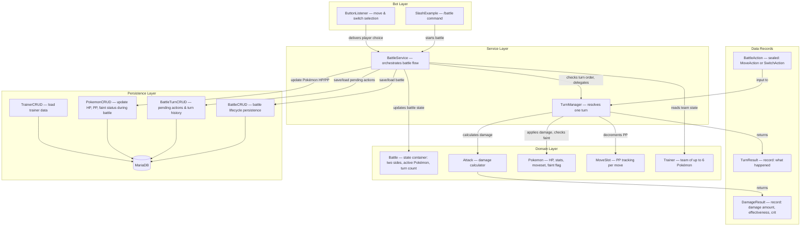
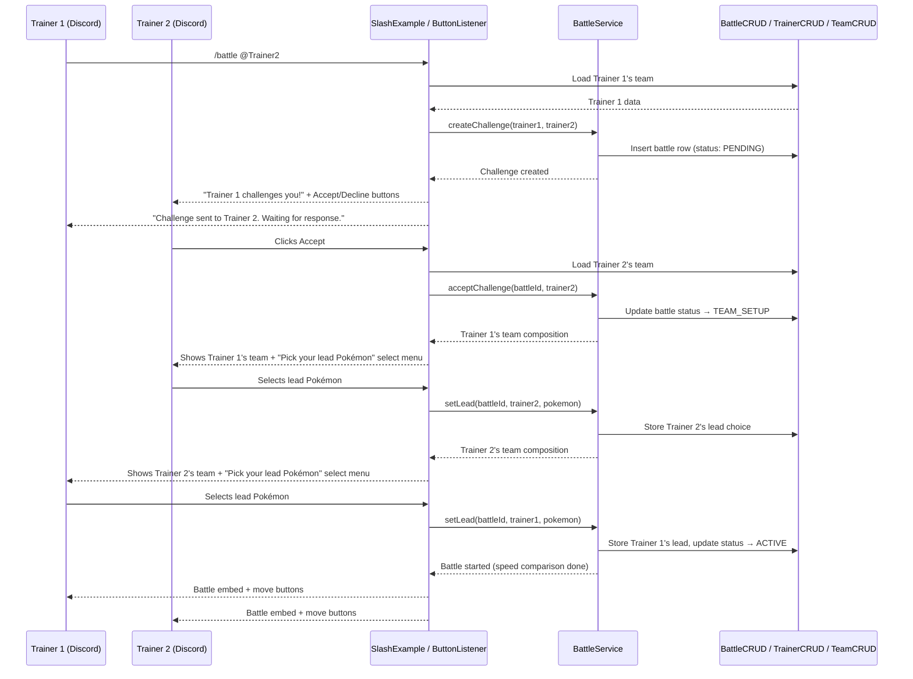
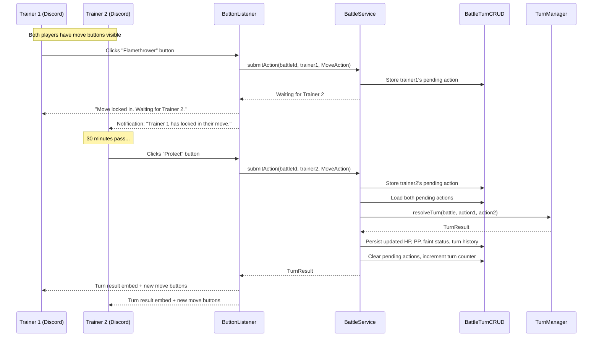
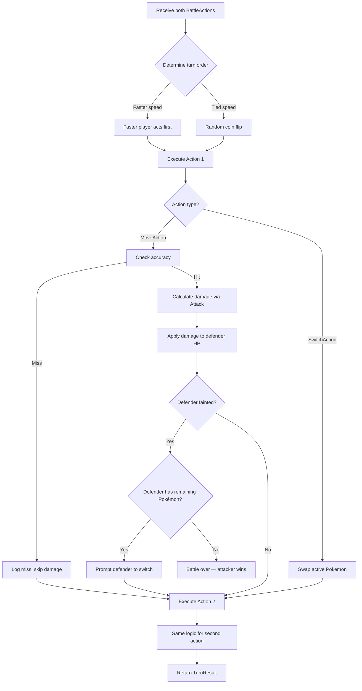
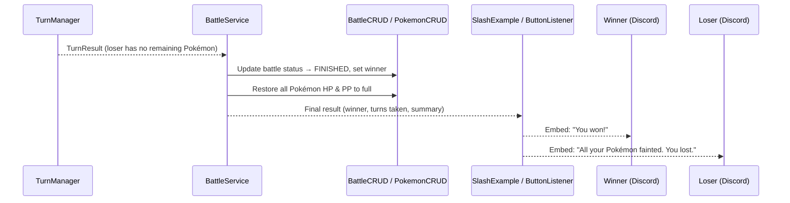
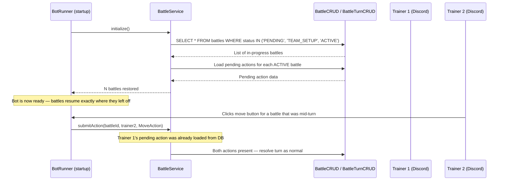
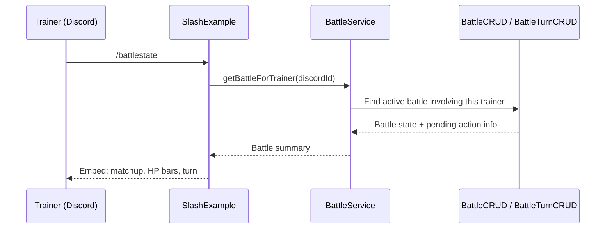

# Java 21 Project Guide — Battle Loop

**Date:** 2026-03-30 (updated 2026-03-31 — added battle persistence)  
**Scope:** Designing and implementing a turn-based battle loop for the Pokémon OOP Discord bot  
**Java Version:** 21  

---

## 1. Project Overview

The goal is to build a **turn-based battle loop** that lets two trainers (or a trainer and a wild Pokémon) fight each other through the Discord bot. Each turn, both sides choose a move, the faster Pokémon attacks first, damage is applied, and the game checks if anyone fainted. The loop repeats until one side has no usable Pokémon left.

**What already exists:**

- `Battle` — has `dealDamage()`, `checkSpeed()`, `checkFainted()`, and an empty `startTurn()` placeholder
- `Attack` — fully functional damage calculator (STAB, type effectiveness, crits, accuracy, random factor)
- `MoveSlot` — wraps a `Move` with mutable PP tracking and a `use()` method
- `Pokemon` — complete stat model, HP management, moveset (max 4 `MoveSlot`s), faint flag
- `Trainer` — team of up to 6 Pokémon
- `SlashExample` — has a `battlestate` command that currently returns a hardcoded reply

**Key Assumptions:**

- Battles are **1v1 Trainer vs. Trainer** (each with a team of 1–6 Pokémon). Wild encounters can be added later with the same loop.
- Each battle involves exactly **two participants**. No multi-battles.
- Moves are the only action for now — no items, no running, no switching mid-turn (switching on faint is required).
- **Status effects** (burn, paralysis, etc.) are out of scope for the initial loop. The architecture should leave room for them, but they are not implemented yet.
- The battle runs through **Discord interactions** (buttons for move selection, switch-on-faint prompts) — not through console I/O.
- **Battles are asynchronous.** Both players select moves blind (simultaneous selection), but there is no time pressure — Trainer 1 might pick a move now, and Trainer 2 might pick theirs 30 minutes later. The turn resolves only once both have submitted.
- **Battle state must survive bot restarts.** Because battles can span hours or days, in-progress battles (including pending move selections) are persisted to MariaDB. If the bot goes down and comes back up, all active battles resume where they left off.

---

## 2. Recommended Java 21 Features

### Enhanced Switch (Arrow Syntax)

**What it is:** Switch expressions using `->` arrows that return values directly, eliminating fall-through bugs.  
**Where it fits:** The battle loop has several branching points — determining move category for stat lookup, handling turn outcomes (miss, hit, faint), routing battle phases. Arrow-syntax switches make each branch self-contained.  
**Why it helps:** Eliminates accidental fall-through, reduces boilerplate, and makes the possible outcomes of each phase visually explicit.

### Sealed Interfaces

**What it is:** An interface that declares exactly which classes can implement it, giving the compiler a complete list of subtypes.  
**Where it fits:** Battle actions. Right now the only action is "use a move," but the design should accommodate "switch Pokémon" and eventually "use item." A `sealed interface BattleAction permits MoveAction, SwitchAction` gives you a fixed, exhaustive set of action types.  
**Why it helps:** When combined with pattern matching switch, the compiler will warn you if a new action type is added but not handled in the battle loop — catching bugs at compile time instead of runtime.

### Pattern Matching for Switch

**What it is:** The ability to match on an object's type and destructure it in a single `case` arm:  `case MoveAction(var slot, var target) -> ...`  
**Where it fits:** Processing the chosen `BattleAction` each turn. Instead of `instanceof` checks and casts, each action type gets its own `case` branch with direct access to its fields.  
**Why it helps:** Cleaner than if/else-instanceof chains, exhaustiveness checking when combined with sealed types, and future-proof for adding new action kinds.

### Records

**What it is:** A compact, immutable data carrier class — the compiler generates the constructor, getters, `equals()`, `hashCode()`, and `toString()`.  
**Where it fits:** Several data-carrying objects in the battle loop are naturally immutable snapshots:

- `TurnResult` — what happened during a turn (damage dealt, effectiveness, crit, fainted, etc.)
- `MoveAction` / `SwitchAction` — a player's chosen action for the turn
- `DamageResult` — output of the damage calculation (amount, effectiveness, crit flag)  

**Why it helps:** Eliminates boilerplate getters and constructors. Records enforce immutability, which makes turn results safe to pass to the bot layer for formatting without worrying about mutation.

### `var` Local Type Inference

**What it is:** Lets you write `var result = calculateDamage(...)` instead of repeating the type on the left side when it's obvious from the right side.  
**Where it fits:** Local variables throughout the battle loop where the type is clear from context.  
**Why it helps:** Reduces visual noise, especially for long generic types like `Map<Trainer, BattleAction>`.

---

## 3. Architecture / Component Breakdown

The battle loop adds a **service layer** between the existing domain model and the bot layer, and extends the **persistence layer** with battle-specific DAO classes. This keeps battle orchestration logic testable without Discord and ensures battle state survives bot restarts.

### Architecture Diagram



### Plain English Walkthrough

> **How the architecture works:**
>
> 1. The **Bot Layer** owns all Discord I/O. The slash command handler starts a battle; the button listener collects move/switch choices from players. These handlers translate Discord events into domain-layer calls and format results as embeds.
> 2. The **Service Layer** is new. `BattleService` manages the lifecycle of a battle (start → turns → end), buffers each player's action until both have submitted, and delegates turn resolution to `TurnManager`. After every state change, `BattleService` persists the updated state to the database so nothing is lost if the bot restarts.
> 3. The **Domain Layer** is the existing code. `Battle` holds state (the two trainers, their active Pokémon, turn count). `Attack` calculates damage. `Pokemon` tracks HP and stats. `MoveSlot` tracks PP. None of these classes import JDA or do I/O.
> 4. **Data Records** are immutable snapshots that carry information between layers. `BattleAction` is what a player chose. `TurnResult` is what happened. `DamageResult` is the output of one damage calculation. These are safe to pass anywhere because they can't be mutated after creation.
> 5. The **Persistence Layer** is the existing `pokemonGame.db` package, extended with new DAO classes for battles. `BattleCRUD` stores the battle itself (who's fighting, whose turn, is it finished). `BattleTurnCRUD` stores pending move selections and turn history. The existing `PokemonCRUD` is reused to persist HP/PP/faint changes during battle. All database access follows the project's existing patterns: try-with-resources, prepared statements, HikariCP connection pooling.
> 6. Data flows **inward** for commands (Bot → Service → Domain) and **outward** for results (Domain → Service → Bot → Discord). The persistence layer sits **beside** the service layer — `BattleService` reads and writes to it, but `TurnManager` and the domain classes never touch the database directly.

---

## 4. Flow Diagrams

### Flow 1: Battle Challenge and Team Setup

Before the battle loop starts, both trainers go through a multi-step handshake to set up their teams and pick their lead Pokémon.



> **What happens during battle setup:**
>
> 1. Trainer 1 uses the `/battle` slash command, mentioning Trainer 2.
> 2. The bot loads Trainer 1's team and creates a challenge via `BattleService`. The battle is persisted to the database with status `PENDING`.
> 3. Trainer 2 receives a notification with Accept/Decline buttons. This can happen immediately or hours later — the challenge persists in the database.
> 4. When Trainer 2 accepts, they see Trainer 1's team composition and pick their lead Pokémon via a select menu. The battle status moves to `TEAM_SETUP`.
> 5. After Trainer 2 picks their lead, Trainer 1 sees Trainer 2's team and picks their own lead.
> 6. Once both leads are set, the battle status moves to `ACTIVE`. Both players receive the opening battle embed (showing the matchup) and move buttons. The speed comparison determines who goes first on Turn 1, but both players select moves simultaneously.
> 7. Every step is persisted — if the bot restarts between steps 3 and 4, the pending challenge is still in the database and can be resumed.

### Flow 2: Asynchronous Move Selection and Turn Resolution

Both trainers select moves blind (neither sees the other's choice). There is no time pressure — submissions can be minutes, hours, or days apart. The turn resolves only once both have submitted.



> **What happens during asynchronous move selection:**
>
> 1. Both players see move buttons from the previous turn's result (or the opening battle embed for Turn 1).
> 2. Trainer 1 clicks a move button. `BattleService` stores this as a **pending action** in the database via `BattleTurnCRUD`. It does NOT resolve the turn yet.
> 3. Trainer 1 sees a confirmation ("Move locked in"). Trainer 2 gets a notification that Trainer 1 has submitted — but NOT which move was chosen (blind selection preserved).
> 4. Trainer 2 can submit their move at any time — seconds or hours later. The pending action is in the database, so even a bot restart doesn't lose Trainer 1's choice.
> 5. When Trainer 2 submits, `BattleService` detects both actions are in. It loads both from the database, calls `TurnManager.resolveTurn()`, and gets back a `TurnResult`.
> 6. `BattleService` persists all state changes to the database: updated Pokémon HP and PP (via `PokemonCRUD`), faint flags, the turn result in the history log, and clears the pending actions for the next turn.
> 7. Both players receive the turn result embed and new move buttons for the next turn.

### Flow 3: Turn Resolution (Game Logic)

This is what happens inside `TurnManager.resolveTurn()` — pure game logic, no I/O, no database.



> **What happens during turn resolution:**
>
> 1. `TurnManager` receives both `BattleAction`s (already loaded from the database by `BattleService`).
> 2. It determines turn order using `checkSpeed()` — higher speed goes first, ties broken randomly. (Switching always happens before attacking, if you add that rule later.)
> 3. The first action executes:
>    - **Move:** Check accuracy (`Attack.checkAccuracy`). If it misses, log "missed!" and skip to the second action. If it hits, calculate damage (`Attack.calculateDamage`), apply it to the defender's HP, and check if the defender fainted.
>    - **Switch:** Swap the trainer's active Pokémon to the chosen team member.
> 4. If the defender fainted and has remaining Pokémon, they're prompted to switch (this prompt goes back through `BattleService` and the bot layer). If they have no remaining Pokémon, the battle ends immediately.
> 5. If the battle continues, the second action executes with the same logic. (A fainted Pokémon cannot act — its action is skipped.)
> 6. A `TurnResult` record captures everything that happened. `TurnManager` returns it to `BattleService` — it never touches the database itself.

### Flow 4: Battle End



> **What happens when the battle ends:**
>
> 1. A turn resolves, and the loser's last Pokémon faints.
> 2. `TurnManager` reports this in the `TurnResult`.
> 3. `BattleService` updates the battle row in the database: status becomes `FINISHED`, the winner is recorded. Pending actions are cleared.
> 4. All Pokémon HP and PP are restored to full and persisted via `PokemonCRUD`. (This is the standard mainline behavior — the battle doesn't leave permanent damage.)
> 5. The bot formats the final result and sends embeds to both players.
> 6. The battle row remains in the database as a historical record. No in-memory cleanup is needed because battle state lives in the database, not in a `Map`.

### Flow 5: Bot Restart Recovery

Because battles can span hours, the bot must be able to restart without losing any battle state.



> **What happens when the bot restarts:**
>
> 1. During startup, `BotRunner` initializes `BattleService`.
> 2. `BattleService` queries the database for all battles that aren't `FINISHED` — this includes `PENDING` challenges, battles in `TEAM_SETUP`, and `ACTIVE` battles mid-turn.
> 3. For `ACTIVE` battles, it also loads any pending actions (e.g., Trainer 1 had already submitted a move before the restart). These are stored in the `battle_pending_actions` table.
> 4. The bot is now fully caught up. When Trainer 2 eventually clicks their move button, `BattleService` finds Trainer 1's pending action already loaded (from the database), resolves the turn, and continues as normal.
> 5. No battle state is lost. No player needs to re-submit moves. The experience is seamless.

### Flow 6: Checking Battle State (`/battlestate`)

Either player can check the current state of their battle at any time.



> **What happens when a player checks battle state:**
>
> 1. The player uses `/battlestate` in any channel.
> 2. `BattleService` queries the database for an active battle involving this player's Discord ID.
> 3. It returns the current state: which Pokémon are active, their HP, the turn number, and whether the player's opponent has already submitted a move (without revealing which move).
> 4. The bot formats this into an embed showing HP bars, the matchup, and a status message like "Waiting for Trainer 2 to pick a move" or "Both moves are in — turn resolving."  

---

## 5. Suggested Implementation Order

Build from the **inside out** — domain records first, then the turn logic, then the service, then the bot integration last.

### Step 1: Create Data Records (`BattleAction`, `DamageResult`, `TurnResult`)

**What to build:** Three record classes in the `pokemonGame` package.

```
BattleAction (sealed interface)
├── MoveAction(MoveSlot slot, Pokemon target)   — record
└── SwitchAction(Pokemon switchTo)              — record

DamageResult(int damage, float effectiveness, boolean isCritical, boolean missed)  — record

TurnResult(DamageResult action1Result, DamageResult action2Result, 
           boolean battleOver, Trainer winner)  — record
```

**Why this order:** These are pure data carriers with no dependencies. They compile immediately and give you the "vocabulary" the rest of the system uses to communicate. Defining them first ensures every subsequent class speaks the same language.

**Definition of done:** Records compile. You can write a trivial test that creates each record and asserts field access works (this validates your record definitions are correct).

---

### Step 2: Create Battle Persistence Schema and DAOs

**What to build:** SQL migration scripts and two new DAO classes in `pokemonGame.db`. These go *before* the game logic because the asynchronous battle model depends on persistence from the very start — there is no "in-memory only" version that works correctly.

#### Database Tables

Create migration scripts following the project's existing pattern (numbered `.sql` files):

**`battles` table** — one row per battle:

| Column | Type | Purpose |
| -------- | ------ | -------- |
| `battle_id` | INT AUTO_INCREMENT PK | Unique battle identifier |
| `trainer1_id` | INT FK → trainers | Challenger |
| `trainer2_id` | INT FK → trainers | Challenged player |
| `trainer1_active_pokemon_id` | INT FK → pokemon_instances | Trainer 1's currently active Pokémon |
| `trainer2_active_pokemon_id` | INT FK → pokemon_instances | Trainer 2's currently active Pokémon |
| `status` | ENUM('PENDING', 'TEAM_SETUP', 'ACTIVE', 'FINISHED') | Battle lifecycle phase |
| `winner_id` | INT FK → trainers | Set when battle ends |
| `turn_number` | INT DEFAULT 0 | Current turn counter |
| `created_at` | TIMESTAMP | When the challenge was issued |
| `updated_at` | TIMESTAMP | Last state change (for stale battle detection) |

**`battle_pending_actions` table** — holds each player's move choice until both have submitted:

| Column | Type | Purpose |
| -------- | ------ | -------- |
| `battle_id` | INT FK → battles | Which battle |
| `trainer_id` | INT FK → trainers | Who submitted |
| `action_type` | ENUM('MOVE', 'SWITCH') | What kind of action |
| `move_slot_index` | SMALLINT | Which move slot (0–3), null for switch actions |
| `switch_pokemon_id` | INT FK → pokemon_instances | Which Pokémon to switch to, null for move actions |
| `submitted_at` | TIMESTAMP | When the action was submitted |
| PK: (`battle_id`, `trainer_id`) | | One pending action per player per battle |

**`battle_turn_history` table** (optional, for `/battlestate` and post-battle review):

| Column | Type | Purpose |
| -------- | ------ | -------- |
| `battle_id` | INT FK → battles | Which battle |
| `turn_number` | INT | Which turn |
| `summary` | TEXT | Human-readable turn summary (JSON or formatted text) |
| PK: (`battle_id`, `turn_number`) | | One entry per turn |

#### DAO Classes

**`BattleCRUD`** in `pokemonGame.db`:

- `createBattle(int trainer1Id, int trainer2Id)` → returns `battle_id`
- `getBattleById(int battleId)` → returns `Battle` domain object
- `getActiveBattleForTrainer(int trainerId)` → finds the trainer's current active battle (or null)
- `updateBattleStatus(int battleId, String status)` → updates the `status` column
- `setActivePokemon(int battleId, int trainerId, int pokemonInstanceId)` → sets the active Pokémon
- `setWinner(int battleId, int winnerId)` → records the winner
- `incrementTurnNumber(int battleId)` → bumps the turn counter
- `getAllActiveBattles()` → returns all non-FINISHED battles (for bot restart recovery)

**`BattleTurnCRUD`** in `pokemonGame.db`:

- `submitPendingAction(int battleId, int trainerId, BattleAction action)` → inserts/replaces a pending action row
- `getPendingActions(int battleId)` → returns 0, 1, or 2 pending actions
- `clearPendingActions(int battleId)` → deletes pending actions after turn resolution
- `saveTurnHistory(int battleId, int turnNumber, String summary)` → saves a turn result for later review
- `getTurnHistory(int battleId)` → returns all turn summaries for a battle

Both classes follow the existing project patterns: try-with-resources, prepared statements, `DatabaseSetup.getConnection()` (HikariCP), SLF4J logging.

**Why this order:** In the original plan, persistence was an afterthought. But because battles are asynchronous (a turn might span hours) and must survive bot restarts, the database tables and DAOs need to exist before `BattleService` can be built. You can't meaningfully test `BattleService` if it has no way to store pending actions. Building persistence early aligns with the project's existing pattern — the `trainers`, `pokemon_instances`, and `trainer_teams` tables were all built before the bot commands that use them.

**Definition of done:** Migration scripts run successfully against MariaDB. DAO methods can create a battle, store pending actions, retrieve them, and clear them. Integration tests confirm round-trip persistence (write a battle, read it back, verify all fields match).

---

### Step 3: Refactor `Battle` into a State Container

**What to build:** Evolve the existing `Battle` class so it clearly holds battle state:

- The two `Trainer` participants
- Each trainer's currently active `Pokemon` (the one on the field)
- A turn counter
- A `status` field matching the database enum: `PENDING`, `TEAM_SETUP`, `ACTIVE`, `FINISHED`
- An optional `Trainer winner`
- A `battleId` field (set after database insertion, used to look up the battle)
- A method `getAllRemainingPokemon(Trainer)` that returns non-fainted team members

Keep the existing `checkSpeed()` and `checkFainted()` methods — they still work. Move `dealDamage()` logic into `TurnManager` (Step 4), since applying damage is part of turn resolution, not battle state.

**Why this order:** `Battle` is the central state object that both `TurnManager` and `BattleService` depend on, and it must align with the database schema from Step 2. Getting its shape right before writing the logic that manipulates it prevents rework.

**Definition of done:** `Battle` compiles with the new fields. Existing `BattleTest` tests still pass (adapt them if method signatures changed). New tests verify: active Pokémon can be set/read, `getAllRemainingPokemon` correctly filters fainted members, status starts as `PENDING`, `battleId` can be set/read.

---

### Step 4: Build `TurnManager` — Single-Turn Resolution

**What to build:** A new class `TurnManager` in the `pokemonGame` package. It takes a `Battle` and both players' `BattleAction`s and resolves one turn:

1. Determine turn order via `Battle.checkSpeed()`.
2. Execute the first action:
   - `MoveAction` → check PP (`MoveSlot.use()`), check accuracy (`Attack.checkAccuracy`), calculate damage (`Attack.calculateDamage`), apply to defender's HP (`Pokemon.setCurrentHP`), check faint (`Battle.checkFainted`).
   - `SwitchAction` → swap the trainer's active Pokémon on the `Battle` object.
3. If the defender fainted, check if they have remaining Pokémon. If not, battle is over.
4. Execute the second action (skip if that Pokémon fainted during action 1).
5. Return a `TurnResult`.

`TurnManager` does **not** touch the database. It operates purely on in-memory domain objects. `BattleService` is responsible for loading state from the DB before calling `TurnManager` and persisting changes after.

**Why this order:** `TurnManager` is the heart of the battle loop. It uses the domain classes (`Attack`, `Pokemon`, `MoveSlot`) that already work and the records from Step 1. Building it here means you can test full turns in isolation — no Discord, no service layer, no database.

**Definition of done:** Unit tests cover:

- A turn where both Pokémon attack and neither faints
- A turn where one Pokémon faints from the first attack (second action skipped)
- A turn where a move misses (accuracy). This is hard to test deterministically — use a seed or mock, or test probabilistically like the existing speed-tie tests
- A turn where PP runs out (move fails)
- A turn with a switch action

---

### Step 5: Build `BattleService` — Battle Lifecycle with Persistence

**What to build:** A new class `BattleService` in the `pokemonGame` package. It orchestrates the full battle lifecycle and **delegates all persistence to the DAO classes from Step 2**. Key responsibilities:

- **`createChallenge(Trainer challenger, Trainer opponent)`** — validates both trainers have Pokémon and neither is already in an active battle. Inserts a battle row with status `PENDING` via `BattleCRUD`. Returns the `battleId`.
- **`acceptChallenge(int battleId, Trainer trainer)`** — verifies the trainer is the challenged party. Updates status to `TEAM_SETUP`. Returns Trainer 1's team for viewing.
- **`setLead(int battleId, Trainer trainer, Pokemon lead)`** — stores the trainer's lead Pokémon choice. When both leads are set, updates status to `ACTIVE`.
- **`submitAction(int battleId, Trainer trainer, BattleAction action)`** — stores the action as a pending row in `battle_pending_actions` via `BattleTurnCRUD`. If both players have submitted, loads both actions, calls `TurnManager.resolveTurn()`, persists all state changes (HP, PP, faint flags via `PokemonCRUD`; turn history via `BattleTurnCRUD`; turn counter via `BattleCRUD`), clears pending actions, and returns the `TurnResult`. If only one player has submitted, returns a "waiting" indicator.
- **`getBattleForTrainer(long discordId)`** — queries `BattleCRUD.getActiveBattleForTrainer()` and returns the current battle state for the `/battlestate` command.
- **`restoreActiveBattles()`** — called on bot startup. Queries `BattleCRUD.getAllActiveBattles()` to reload in-progress battles. Pending actions are loaded from `BattleTurnCRUD`. No battle state is lost across restarts.

**Why this order:** `BattleService` ties together `TurnManager` (Step 4), `Battle` (Step 3), and the DAOs (Step 2). It's the coordination point between game logic and persistence. Building it before the bot layer means you can test the full lifecycle — including the asynchronous "submit one action, then the other" pattern — in integration tests against a real or in-memory database.

**Definition of done:** Integration tests cover:

- Creating a challenge persists a `PENDING` battle row
- Accepting a challenge transitions to `TEAM_SETUP`
- Setting both leads transitions to `ACTIVE`
- Submitting one action doesn't resolve the turn (returns "waiting")
- Submitting both actions triggers turn resolution and persists updated HP/PP
- Battle ends correctly and transitions to `FINISHED` with a winner
- Attempting to act in a finished battle is rejected
- `restoreActiveBattles()` recovers a battle with one pending action intact
- A player cannot be in two active battles at once

---

### Step 6: Wire into the Bot Layer

**What to build:** Update the Discord-facing code:

- **`/battle @user`** slash command: Load trainers from DB, call `BattleService.createChallenge()`, send a challenge embed to the opponent with Accept/Decline buttons.
- **Accept button:** Call `BattleService.acceptChallenge()`, present Trainer 1's team to Trainer 2, show a "pick your lead" select menu.
- **Lead selection:** Call `BattleService.setLead()`. When both leads are set, send the opening battle embed with move buttons to both players.
- **Move buttons:** When a player clicks a move button, call `BattleService.submitAction()` with a `MoveAction`. If only one action is in, confirm to the submitter and notify the opponent. If both actions are in, display the turn result embed to both players with new move buttons.
- **Switch prompt:** When a Pokémon faints and the trainer has reserves, send a select menu / buttons for the remaining Pokémon. On selection, call `BattleService.submitAction()` with a `SwitchAction`.
- **`/battlestate`:** Call `BattleService.getBattleForTrainer()`, format the result as an embed with HP bars, matchup, turn number, and pending action status.
- **Bot startup:** Call `BattleService.restoreActiveBattles()` during `BotRunner` initialization.

**Why this order:** The bot layer is last because it's the thinnest layer — it only translates Discord events to `BattleService` calls and formats results. All the logic and persistence are already tested by this point.

**Definition of done:** Two users can fight a complete battle through Discord — challenging, accepting, picking leads, choosing moves via buttons, seeing turn results as embeds, switching when a Pokémon faints, and seeing a winner declared. The bot can restart mid-battle without losing any state.

---

### Step 7: Post-Battle Cleanup and Polish

**What to build:**

- **Heal all Pokémon** after a battle ends (restore HP and PP via `PokemonCRUD`) — or persist damage if you want a Nuzlocke-style experience.
- **Forfeit:** Handle a player using `/forfeit` — set the other player as the winner, transition to `FINISHED`, notify both players.
- **Stale battle detection:** A `ScheduledExecutorService` that periodically checks `battles.updated_at` for battles with no activity in N days. Either auto-forfeit or send a reminder DM. This prevents the database from filling up with abandoned battles.
- **Edge cases:** Handle the same player being in two battles at once (reject the second challenge), handle a trainer with all-fainted Pokémon trying to start a battle (reject), handle a player trying to act when it's not their turn or the battle is already over.
- **Logging:** Add SLF4J logging at key points in `BattleService` for debugging (battle created, action submitted, turn resolved, battle ended).

**Why this order:** Polish comes after the core works. These are all important but none block the main loop.

**Definition of done:** Edge cases are handled gracefully with user-friendly messages. Stale battles are cleaned up automatically. No orphaned rows in `battle_pending_actions` after a battle ends or times out.

---

## 6. Potential Pitfalls

| # | Pitfall | Why It Happens | How to Avoid |
| --- | --------- | ---------------- | -------------- |
| 1 | **Putting turn logic in the bot layer** | It feels natural to write the loop inside the button click handler since that's where user input arrives | Keep the bot layer thin — it collects input and calls `BattleService`. All game logic stays in the domain/service layer. This makes it testable without Discord. |
| 2 | **Blocking Discord's event thread** | JDA dispatches events on a small thread pool. If turn resolution takes too long or waits for the second player, the bot stops responding to other commands | Use `deferReply()` to acknowledge interactions immediately. Store pending actions in `BattleService` and only resolve when both players have submitted — don't block in a `while` loop waiting for input. |
| 3 | **Mutable state leaking between turns** | A `TurnResult` that holds references to live `Pokemon` objects lets the bot layer accidentally mutate game state (e.g., changing HP during formatting) | Use records for all cross-layer data. Records are immutable. Copy HP values into the record as `int` fields, not as `Pokemon` references. |
| 4 | **Forgetting that the first attacker can end the battle** | If the faster Pokémon knocks out the slower one, the slower one's action must be skipped. Easy to forget and apply damage from a fainted Pokémon | In `TurnManager`, check `isFainted()` before executing the second action. Write a specific test for this case. |
| 5 | **Not decrementing PP** | `MoveSlot.use()` exists but it's easy to forget to call it, especially when refactoring damage application | Always call `moveSlot.use()` before calculating damage. If PP is 0, the move fails (like Struggle in the main games). Test that PP decreases after each move use. |
| 6 | **Race conditions with two players submitting simultaneously** | Two Discord button clicks arrive at the same time on different threads, both trying to modify the same `Battle` | Use the database as the source of truth. `INSERT ... ON DUPLICATE KEY` for `battle_pending_actions` is atomic — the database handles the concurrency. In `submitAction()`, check the count of pending actions *after* your insert, inside the same transaction. If both are in, resolve the turn. This avoids Java-level locking entirely. |
| 7 | **Orphaned battles filling the database** | A player starts a battle, then disappears. The battle row sits in `ACTIVE` forever | Add a stale battle check: a `ScheduledExecutorService` that runs daily and queries `battles WHERE status != 'FINISHED' AND updated_at < NOW() - INTERVAL 7 DAY`. Auto-forfeit or delete these. The `updated_at` column makes this query cheap. |
| 8 | **Ignoring accuracy for 100% moves** | The existing `Attack.checkAccuracy` handles this, but if you ever bypass it "for simplicity" during early development, you'll forget to add it back | Always go through `Attack.checkAccuracy`, even during testing. If you want deterministic test results, control the random seed — don't skip the accuracy check. |
| 9 | **Giant `TurnManager` class** | As features are added (status effects, weather, abilities), the turn resolution method grows to hundreds of lines | Start with a clean method structure: `resolveAction()` calls `executeMoveAction()` or `executeSwitchAction()`. Each is a small, focused method. When status effects arrive, they plug into `resolveAction()` as pre/post hooks without touching the damage calculation. |
| 10 | **Not restoring state after tests** | If tests modify `Pokemon` HP or PP and share objects across test methods, results become order-dependent | Use `@BeforeEach` to create fresh `Pokemon`, `Trainer`, and `Battle` objects for every test. Never share mutable state between test methods. The existing tests already follow this pattern — keep it. |
| 11 | **Not testing the persistence round-trip** | You test `TurnManager` with in-memory objects and assume the database will "just work." Then field mappings are wrong, or a column is misspelled, and it breaks in production | Write integration tests that go through `BattleService` → database → read back. Use H2 in-memory or a test MariaDB instance. Verify that a battle can be created, an action submitted, the bot "restarted" (new `BattleService` loads from DB), and the battle continues correctly. |
| 12 | **Storing Move objects in the database** | Trying to serialize a `Move` or `MoveSlot` to the database is complex and fragile — move stats live in the Java class, not the database | Store only the `move_slot_index` (0–3) in `battle_pending_actions`. When loading a pending action, look up the Pokémon from the database, get its moveset, and index into it. The `Move` object is reconstructed from the Java code, not from a database column. |
| 13 | **Inconsistent state between Java objects and database** | `TurnManager` modifies `Pokemon` HP in memory, but someone forgets to persist the change afterward | Make `BattleService` the single point of persistence. After `TurnManager.resolveTurn()` returns, `BattleService` iterates through the affected Pokémon and calls `PokemonCRUD.updateDBPokemon()` for each. `TurnManager` never touches the database — it only mutates the in-memory objects it was given. |

---

## 7. Tool & Technology Recommendations

### Already in Use (No Changes Needed)

| Technology | Role | Notes |
| ------------ | ------ | ------- |
| **Java 21** | Core language | Continue using. The battle loop benefits from records, sealed interfaces, and pattern matching. |
| **Maven** | Build tool | Continue using. No new plugins needed for the battle loop. |
| **JDA 6.3.1** | Discord bot framework | Provides buttons, select menus, embeds, and deferred replies — everything the battle UI needs. |
| **MariaDB + JDBC** | Persistence | Trainer and team data already persisted. Now extended with `battles`, `battle_pending_actions`, and `battle_turn_history` tables for full battle state persistence. |
| **SLF4J + Logback** | Logging | Use `logger.info()` for turn results and `logger.debug()` for damage calculation details. |
| **JUnit 5** | Testing | The battle loop is heavily testable — `TurnManager` and `BattleService` are pure logic. |

### Recommended Additions

| Technology | Why It Fits | How It Integrates | Alternative |
| ------------ | ------------- | ------------------- | ------------- |
| **Mockito** | Testing `BattleService` in isolation requires mocking `TurnManager` or `Attack` to control randomness (crits, accuracy, damage range) | Add `org.mockito:mockito-core` as a `<scope>test</scope>` dependency in `pom.xml`. Use `@Mock` and `when(...).thenReturn(...)` to control random outcomes in tests. | Test probabilistically like the existing speed-tie tests — run many trials and assert statistical properties. Works but is slower and less precise. |
| **AssertJ** | Fluent assertions make test failures more readable: `assertThat(result.damage()).isGreaterThan(0)` reads better than `assertTrue(result.damage() > 0)` | Add `org.assertj:assertj-core` as a `<scope>test</scope>` dependency. Use `assertThat()` instead of JUnit's `assert*` methods. | Continue with JUnit 5 assertions — perfectly functional, just less readable for complex assertions. |
| **H2 (in-memory database)** | Battle persistence integration tests need a database. H2 runs in-memory inside the JVM — no external server needed, tests run fast and in isolation | Add `com.h2database:h2` as a `<scope>test</scope>` dependency. Configure a test `DataSource` pointing to `jdbc:h2:mem:test;MODE=MariaDB` (MariaDB compatibility mode). Run the same migration scripts against H2 in test setup. | Use a dedicated MariaDB test database. More realistic (catches MariaDB-specific SQL quirks) but requires database infrastructure in the test environment. |

### Not Needed Yet

| Technology | Why Not |
| ------------ | --------- |
| **Spring / Quarkus** | The project is intentionally lightweight for learning. A full framework would add massive complexity without proportional benefit for a Discord bot. |
| **Hibernate / JPA** | The SQL is simple and educational. Raw JDBC with prepared statements teaches more about databases than an ORM at this stage. |
| **Redis / Caching** | Battle state is persisted in MariaDB. An in-memory cache could speed up reads, but MariaDB handles the query volume of a Discord bot easily — premature optimization. |
| **WebSockets** | Discord handles real-time communication through JDA. No need for a separate WebSocket layer. |
