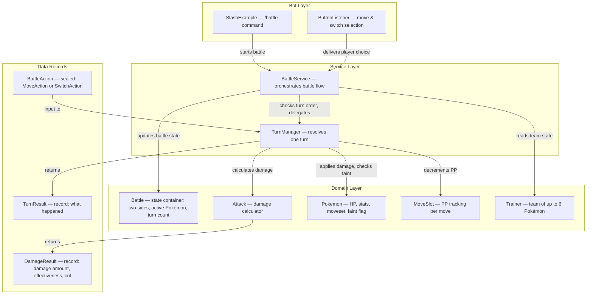
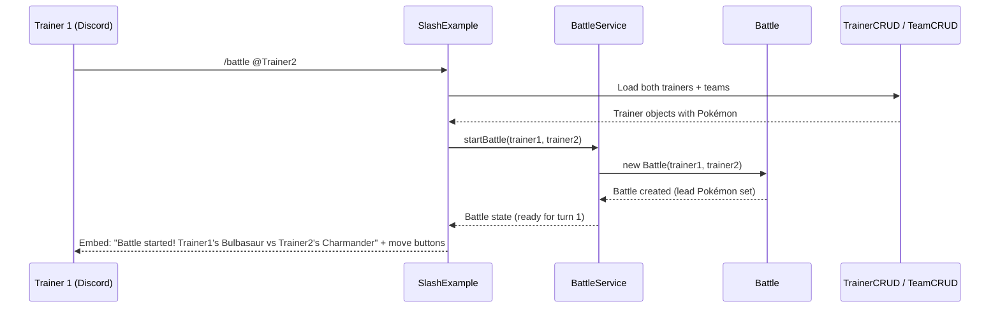
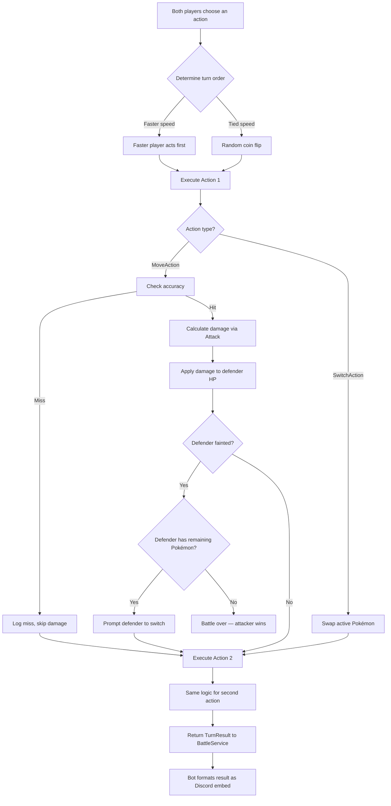
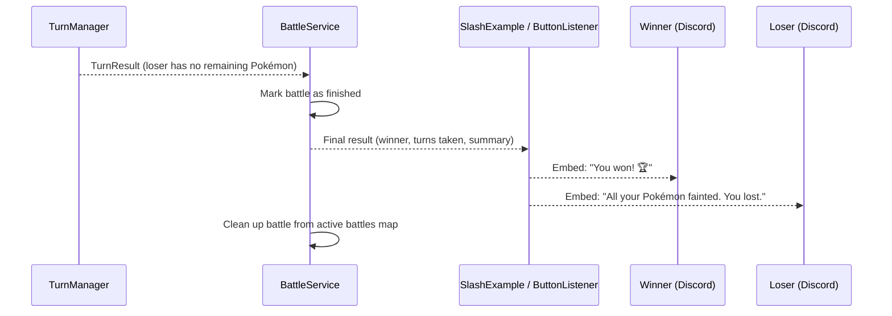

# Java 21 Project Guide — Battle Loop

**Date:** 2026-03-30  
**Scope:** Designing and implementing a turn-based battle loop for the Pokémon OOP Discord bot  
**Java Version:** 21  

---

## 1. Project Overview

The goal is to build a **turn-based battle loop** that lets two trainers (or a trainer and a wild Pokémon) fight each other through the Discord bot. Each turn, both sides choose a move, the faster Pokémon attacks first, damage is applied, and the game checks if anyone fainted. The loop repeats until one side has no usable Pokémon left.

**What already exists:**

- `Battle` — has `dealDamage()`, `checkSpeed()`, `checkFainted()`, and an empty `startTurn()` placeholder
- `Attack` — fully functional damage calculator (STAB, type effectiveness, crits, accuracy, random factor)
- `MoveSlot` — wraps a `Move` with mutable PP tracking and a `use()` method
- `Pokemon` — complete stat model, HP management, moveset (max 4 `MoveSlot`s), faint flag
- `Trainer` — team of up to 6 Pokémon
- `SlashExample` — has a `battlestate` command that currently returns a hardcoded reply

**Key Assumptions:**

- Battles are **1v1 Trainer vs. Trainer** (each with a team of 1–6 Pokémon). Wild encounters can be added later with the same loop.
- Each battle involves exactly **two participants**. No multi-battles.
- Moves are the only action for now — no items, no running, no switching mid-turn (switching on faint is required).
- **Status effects** (burn, paralysis, etc.) are out of scope for the initial loop. The architecture should leave room for them, but they are not implemented yet.
- The battle runs through **Discord interactions** (buttons for move selection, switch-on-faint prompts) — not through console I/O.

---

## 2. Recommended Java 21 Features

### Enhanced Switch (Arrow Syntax)

**What it is:** Switch expressions using `->` arrows that return values directly, eliminating fall-through bugs.  
**Where it fits:** The battle loop has several branching points — determining move category for stat lookup, handling turn outcomes (miss, hit, faint), routing battle phases. Arrow-syntax switches make each branch self-contained.  
**Why it helps:** Eliminates accidental fall-through, reduces boilerplate, and makes the possible outcomes of each phase visually explicit.

### Sealed Interfaces

**What it is:** An interface that declares exactly which classes can implement it, giving the compiler a complete list of subtypes.  
**Where it fits:** Battle actions. Right now the only action is "use a move," but the design should accommodate "switch Pokémon" and eventually "use item." A `sealed interface BattleAction permits MoveAction, SwitchAction` gives you a fixed, exhaustive set of action types.  
**Why it helps:** When combined with pattern matching switch, the compiler will warn you if a new action type is added but not handled in the battle loop — catching bugs at compile time instead of runtime.

### Pattern Matching for Switch

**What it is:** The ability to match on an object's type and destructure it in a single `case` arm:  `case MoveAction(var slot, var target) -> ...`  
**Where it fits:** Processing the chosen `BattleAction` each turn. Instead of `instanceof` checks and casts, each action type gets its own `case` branch with direct access to its fields.  
**Why it helps:** Cleaner than if/else-instanceof chains, exhaustiveness checking when combined with sealed types, and future-proof for adding new action kinds.

### Records

**What it is:** A compact, immutable data carrier class — the compiler generates the constructor, getters, `equals()`, `hashCode()`, and `toString()`.  
**Where it fits:** Several data-carrying objects in the battle loop are naturally immutable snapshots:

- `TurnResult` — what happened during a turn (damage dealt, effectiveness, crit, fainted, etc.)
- `MoveAction` / `SwitchAction` — a player's chosen action for the turn
- `DamageResult` — output of the damage calculation (amount, effectiveness, crit flag)  

**Why it helps:** Eliminates boilerplate getters and constructors. Records enforce immutability, which makes turn results safe to pass to the bot layer for formatting without worrying about mutation.

### `var` Local Type Inference

**What it is:** Lets you write `var result = calculateDamage(...)` instead of repeating the type on the left side when it's obvious from the right side.  
**Where it fits:** Local variables throughout the battle loop where the type is clear from context.  
**Why it helps:** Reduces visual noise, especially for long generic types like `Map<Trainer, BattleAction>`.

---

## 3. Architecture / Component Breakdown

The battle loop adds a **service layer** between the existing domain model and the bot layer. This keeps battle orchestration logic testable without Discord.

### Architecture Diagram



### Plain English Walkthrough

> **How the architecture works:**
>
> 1. The **Bot Layer** owns all Discord I/O. The slash command handler starts a battle; the button listener collects move/switch choices from players. These handlers translate Discord events into domain-layer calls and format results as embeds.
> 2. The **Service Layer** is new. `BattleService` manages the lifecycle of a battle (start → turns → end), tracks whose turn it is to choose, and stores active `Battle` instances. `TurnManager` resolves a single turn: receives both players' `BattleAction`s, determines turn order, executes actions, and returns a `TurnResult`.
> 3. The **Domain Layer** is the existing code. `Battle` holds state (the two trainers, their active Pokémon, turn count). `Attack` calculates damage. `Pokemon` tracks HP and stats. `MoveSlot` tracks PP. None of these classes import JDA or do I/O.
> 4. **Data Records** are immutable snapshots that carry information between layers. `BattleAction` is what a player chose. `TurnResult` is what happened. `DamageResult` is the output of one damage calculation. These are safe to pass anywhere because they can't be mutated after creation.
> 5. Data flows **inward** for commands (Bot → Service → Domain) and **outward** for results (Domain → Service → Bot → Discord).

---

## 4. Flow Diagrams

### Flow 1: Starting a Battle



> **What happens when a trainer starts a battle:**
>
> 1. Trainer 1 uses the `/battle` slash command, mentioning Trainer 2.
> 2. The bot loads both trainers and their teams from the database.
> 3. The bot tells `BattleService` to start a new battle with these two trainers.
> 4. `BattleService` creates a `Battle` object. Each trainer's first team member becomes their active (lead) Pokémon.
> 5. The bot sends an embed to Discord showing the matchup and presents move buttons to the first player who needs to choose.

### Flow 2: A Single Turn (Core Loop)



> **What happens during one turn:**
>
> 1. Both players submit their action (choose a move or switch Pokémon). The bot collects these via Discord buttons.
> 2. `TurnManager` determines who goes first using the existing `checkSpeed()` logic — higher speed goes first, ties broken randomly. (Switching always happens before attacking, if you add that rule later.)
> 3. The first action executes:
>    - **Move:** Check accuracy (`Attack.checkAccuracy`). If it misses, log "missed!" and skip to the second action. If it hits, calculate damage (`Attack.calculateDamage`), apply it to the defender's HP, and check if the defender fainted.
>    - **Switch:** Swap the trainer's active Pokémon to the chosen team member.
> 4. If the defender fainted and has remaining Pokémon, they're prompted to switch. If they have no remaining Pokémon, the battle ends immediately.
> 5. If the battle continues, the second action executes with the same logic. (A fainted Pokémon cannot act — its action is skipped.)
> 6. A `TurnResult` record captures everything that happened and is returned to `BattleService`, which passes it to the bot layer for formatting.

### Flow 3: Battle End



> **What happens when the battle ends:**
>
> 1. A turn resolves, and the loser's last Pokémon faints.
> 2. `TurnManager` reports this in the `TurnResult`.
> 3. `BattleService` marks the battle as finished, records the winner, and removes the battle from its active battles map.
> 4. The bot formats the final result and sends embeds to both players.
> 5. All Pokémon HP and PP should be reset (or left damaged, depending on design choice — healing after battle is common in the main games).

---

## 5. Suggested Implementation Order

Build from the **inside out** — domain records first, then the turn logic, then the service, then the bot integration last.

### Step 1: Create Data Records (`BattleAction`, `DamageResult`, `TurnResult`)

**What to build:** Three record classes in the `pokemonGame` package.

```mermaid
BattleAction (sealed interface)
├── MoveAction(MoveSlot slot, Pokemon target)   — record
└── SwitchAction(Pokemon switchTo)              — record

DamageResult(int damage, float effectiveness, boolean isCritical, boolean missed)  — record

TurnResult(DamageResult action1Result, DamageResult action2Result, 
           boolean battleOver, Trainer winner)  — record
```

**Why this order:** These are pure data carriers with no dependencies. They compile immediately and give you the "vocabulary" the rest of the system uses to communicate. Defining them first ensures every subsequent class speaks the same language.

**Definition of done:** Records compile. You can write a trivial test that creates each record and asserts field access works (this validates your record definitions are correct).

---

### Step 2: Refactor `Battle` into a State Container

**What to build:** Evolve the existing `Battle` class so it clearly holds battle state:

- The two `Trainer` participants
- Each trainer's currently active `Pokemon` (the one on the field)
- A turn counter
- A `boolean isFinished` flag and an optional `Trainer winner`
- A method `getAllRemainingPokemon(Trainer)` that returns non-fainted team members

Keep the existing `checkSpeed()` and `checkFainted()` methods — they still work. Move `dealDamage()` logic into `TurnManager` (Step 3), since applying damage is part of turn resolution, not battle state.

**Why this order:** `Battle` is the central state object that `TurnManager` and `BattleService` both depend on. Getting its shape right before writing the logic that manipulates it prevents rework.

**Definition of done:** `Battle` compiles with the new fields. Existing `BattleTest` tests still pass (adapt them if method signatures changed). New tests verify: active Pokémon can be set/read, `getAllRemainingPokemon` correctly filters fainted members, `isFinished` starts as false.

---

### Step 3: Build `TurnManager` — Single-Turn Resolution

**What to build:** A new class `TurnManager` in the `pokemonGame` package. It takes a `Battle` and both players' `BattleAction`s and resolves one turn:

1. Determine turn order via `Battle.checkSpeed()`.
2. Execute the first action:
   - `MoveAction` → check PP (`MoveSlot.use()`), check accuracy (`Attack.checkAccuracy`), calculate damage (`Attack.calculateDamage`), apply to defender's HP (`Pokemon.setCurrentHP`), check faint (`Battle.checkFainted`).
   - `SwitchAction` → swap the trainer's active Pokémon on the `Battle` object.
3. If the defender fainted, check if they have remaining Pokémon. If not, battle is over.
4. Execute the second action (skip if that Pokémon fainted during action 1).
5. Return a `TurnResult`.

**Why this order:** `TurnManager` is the heart of the battle loop. It uses the domain classes (`Attack`, `Pokemon`, `MoveSlot`) that already work and the records from Step 1. Building it here means you can test full turns in isolation — no Discord, no service layer, no database.

**Definition of done:** Unit tests cover:

- A turn where both Pokémon attack and neither faints
- A turn where one Pokémon faints from the first attack (second action skipped)
- A turn where a move misses (accuracy). This is hard to test deterministically — use a seed or mock, or test probabilistically like the existing speed-tie tests
- A turn where PP runs out (move fails)
- A turn with a switch action

---

### Step 4: Build `BattleService` — Battle Lifecycle

**What to build:** A new class `BattleService` in the `pokemonGame` package. It manages:

- **Active battles:** A `Map<Long, Battle>` keyed by a battle ID or channel ID, so the bot can look up which battle a player is in.
- **`startBattle(Trainer t1, Trainer t2)`** — validates both trainers have Pokémon, creates a `Battle`, stores it, returns the initial state.
- **`submitAction(long battleId, Trainer trainer, BattleAction action)`** — stores a player's choice. When both players have submitted, calls `TurnManager.resolveTurn()` and returns the `TurnResult`.
- **`getBattle(long battleId)`** — retrieves current battle state for display.
- **`endBattle(long battleId)`** — cleans up when a battle concludes.

**Why this order:** `BattleService` sits between the bot and the domain. It needs `TurnManager` (Step 3) and `Battle` (Step 2) to exist. Building it before the bot integration means you can test the full battle lifecycle in a unit test without Discord.

**Definition of done:** Unit tests cover:

- Starting a battle returns correct initial state
- Submitting one action doesn't resolve the turn yet
- Submitting both actions triggers turn resolution and returns a `TurnResult`
- Battle ends correctly when one side runs out of Pokémon
- Attempting to act in a finished battle is rejected

---

### Step 5: Wire into the Bot Layer

**What to build:** Update the Discord-facing code:

- **`/battle @user`** slash command: Load trainers from DB, call `BattleService.startBattle()`, send an embed with the matchup and move buttons.
- **Move buttons:** When a player clicks a move button, call `BattleService.submitAction()` with a `MoveAction`. If both actions are in, display the turn result embed.
- **Switch prompt:** When a Pokémon faints and the trainer has reserves, send a select menu / buttons for the remaining Pokémon. On selection, call `BattleService.submitAction()` with a `SwitchAction`.
- **Battle result embed:** Format `TurnResult` into a readable embed — what each Pokémon did, damage dealt, effectiveness, HP remaining, faint messages, and eventual winner.

**Why this order:** The bot layer is last because it's the thinnest layer — it only translates Discord events to `BattleService` calls and formats results. All the logic is already tested by this point.

**Definition of done:** Two users can fight a complete battle through Discord — choosing moves via buttons, seeing turn results as embeds, switching when a Pokémon faints, and seeing a winner declared at the end.

---

### Step 6: Post-Battle Cleanup and Polish

**What to build:**

- **Heal all Pokémon** after a battle ends (restore HP and PP) — or persist damage if you want a Nuzlocke-style experience.
- **Edge cases:** Handle a player leaving mid-battle (forfeit), handle the same player being in two battles at once (reject), handle a trainer with all-fainted Pokémon trying to start a battle.
- **Logging:** Add SLF4J logging at key points in `TurnManager` and `BattleService` for debugging.

**Why this order:** Polish comes after the core works. These are all important but none block the main loop.

**Definition of done:** Edge cases are handled gracefully with user-friendly messages. Battles don't leave orphaned state in `BattleService` after ending or forfeiting.

---

## 6. Potential Pitfalls

| # | Pitfall | Why It Happens | How to Avoid |
| --- | --------- | ---------------- | -------------- |
| 1 | **Putting turn logic in the bot layer** | It feels natural to write the loop inside the button click handler since that's where user input arrives | Keep the bot layer thin — it collects input and calls `BattleService`. All game logic stays in the domain/service layer. This makes it testable without Discord. |
| 2 | **Blocking Discord's event thread** | JDA dispatches events on a small thread pool. If turn resolution takes too long or waits for the second player, the bot stops responding to other commands | Use `deferReply()` to acknowledge interactions immediately. Store pending actions in `BattleService` and only resolve when both players have submitted — don't block in a `while` loop waiting for input. |
| 3 | **Mutable state leaking between turns** | A `TurnResult` that holds references to live `Pokemon` objects lets the bot layer accidentally mutate game state (e.g., changing HP during formatting) | Use records for all cross-layer data. Records are immutable. Copy HP values into the record as `int` fields, not as `Pokemon` references. |
| 4 | **Forgetting that the first attacker can end the battle** | If the faster Pokémon knocks out the slower one, the slower one's action must be skipped. Easy to forget and apply damage from a fainted Pokémon | In `TurnManager`, check `isFainted()` before executing the second action. Write a specific test for this case. |
| 5 | **Not decrementing PP** | `MoveSlot.use()` exists but it's easy to forget to call it, especially when refactoring damage application | Always call `moveSlot.use()` before calculating damage. If PP is 0, the move fails (like Struggle in the main games). Test that PP decreases after each move use. |
| 6 | **Race conditions with two players submitting simultaneously** | Two Discord button clicks arrive at the same time on different threads, both trying to modify the same `Battle` | Synchronize `submitAction()` on the `Battle` object or use a `ConcurrentHashMap` with atomic operations. Alternatively, use a `ReentrantLock` per battle — simpler to reason about than full concurrency. |
| 7 | **Memory leaks from abandoned battles** | A player starts a battle, then leaves. The `Battle` object stays in the active map forever | Add a timeout mechanism — if no action is received within, say, 5 minutes, auto-forfeit and clean up. A `ScheduledExecutorService` can handle this. |
| 8 | **Ignoring accuracy for 100% moves** | The existing `Attack.checkAccuracy` handles this, but if you ever bypass it "for simplicity" during early development, you'll forget to add it back | Always go through `Attack.checkAccuracy`, even during testing. If you want deterministic test results, control the random seed — don't skip the accuracy check. |
| 9 | **Giant `TurnManager` class** | As features are added (status effects, weather, abilities), the turn resolution method grows to hundreds of lines | Start with a clean method structure: `resolveAction()` calls `executeMoveAction()` or `executeSwitchAction()`. Each is a small, focused method. When status effects arrive, they plug into `resolveAction()` as pre/post hooks without touching the damage calculation. |
| 10 | **Not restoring state after tests** | If tests modify `Pokemon` HP or PP and share objects across test methods, results become order-dependent | Use `@BeforeEach` to create fresh `Pokemon`, `Trainer`, and `Battle` objects for every test. Never share mutable state between test methods. The existing tests already follow this pattern — keep it. |

---

## 7. Tool & Technology Recommendations

### Already in Use (No Changes Needed)

| Technology | Role | Notes |
| ------------ | ------ | ------- |
| **Java 21** | Core language | Continue using. The battle loop benefits from records, sealed interfaces, and pattern matching. |
| **Maven** | Build tool | Continue using. No new plugins needed for the battle loop. |
| **JDA 6.3.1** | Discord bot framework | Provides buttons, select menus, embeds, and deferred replies — everything the battle UI needs. |
| **MariaDB + JDBC** | Persistence | Trainer and team data already persisted. Battle results can optionally be stored (win/loss record) later. |
| **SLF4J + Logback** | Logging | Use `logger.info()` for turn results and `logger.debug()` for damage calculation details. |
| **JUnit 5** | Testing | The battle loop is heavily testable — `TurnManager` and `BattleService` are pure logic. |

### Recommended Additions

| Technology | Why It Fits | How It Integrates | Alternative |
| ------------ | ------------- | ------------------- | ------------- |
| **Mockito** | Testing `BattleService` in isolation requires mocking `TurnManager` or `Attack` to control randomness (crits, accuracy, damage range) | Add `org.mockito:mockito-core` as a `<scope>test</scope>` dependency in `pom.xml`. Use `@Mock` and `when(...).thenReturn(...)` to control random outcomes in tests. | Test probabilistically like the existing speed-tie tests — run many trials and assert statistical properties. Works but is slower and less precise. |
| **AssertJ** | Fluent assertions make test failures more readable: `assertThat(result.damage()).isGreaterThan(0)` reads better than `assertTrue(result.damage() > 0)` | Add `org.assertj:assertj-core` as a `<scope>test</scope>` dependency. Use `assertThat()` instead of JUnit's `assert*` methods. | Continue with JUnit 5 assertions — perfectly functional, just less readable for complex assertions. |
| **H2 (in-memory database)** | If battle results need persistence, integration tests should use an in-memory database instead of the real MariaDB | Add `com.h2database:h2` as a `<scope>test</scope>` dependency. Configure a test `DataSource` pointing to `jdbc:h2:mem:test`. | Use a dedicated MariaDB test database. More realistic but requires database infrastructure in the test environment. |

### Not Needed Yet

| Technology | Why Not |
| ------------ | --------- |
| **Spring / Quarkus** | The project is intentionally lightweight for learning. A full framework would add massive complexity without proportional benefit for a Discord bot. |
| **Hibernate / JPA** | The SQL is simple and educational. Raw JDBC with prepared statements teaches more about databases than an ORM at this stage. |
| **Redis / Caching** | Battle state is in-memory and short-lived. No need for external caching. |
| **WebSockets** | Discord handles real-time communication through JDA. No need for a separate WebSocket layer. |
