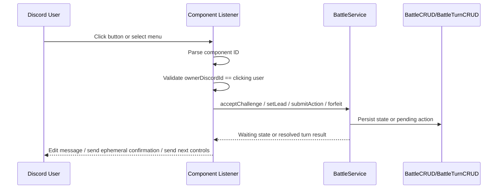

# JDA Button and Select Menu Battle Guide

**Date:** 2026-04-24  
**Scope:** Discord button/select-menu design for battle interactions in Pokemon OOP  
**Java Version:** 21  
**JDA Version:** 6.3.1

---

## 1. Goal

Build battle UI around **Discord message components**, not slash commands for every step.

- Use **buttons** for short, fixed choices: accept, decline, move 1-4, forfeit.
- Use **string select menus** for longer stateful choices: lead selection, forced switch after faint, maybe move replacement when teaching moves.
- Keep **bot layer thin**: parse component ID, validate clicking user, defer/reply, call service layer.
- Keep **battle logic out of listener**: `BattleService` decides whether state transition is valid.

This fits existing battle guide in [Documentation/Battle-Loop-Project-Guide.md](Documentation/Battle-Loop-Project-Guide.md#L555), which already assumes buttons for move selection and select menus for switch flow.

---

## 2. Why Components Fit Battle Flow

Slash commands work well for starting workflows. They work poorly for repeated turn input because every turn needs:

- same user-specific options
- quick click input
- hidden state binding to one battle
- protection against other users clicking same controls

Buttons and select menus solve this better:

- component IDs carry `battleId` and owner ID
- Discord message can be edited in place after each turn
- inputs feel like battle UI instead of admin form
- move choice and switch choice become constrained inputs, so validation gets simpler

---

## 3. Recommended Component Map

| Battle step | JDA component | Why |
|---|---|---|
| Challenge response | `Button.success` / `Button.danger` | Two fixed answers |
| Lead pick | `StringSelectMenu` | Team may have 1-6 options |
| Move pick | `Button.primary` / `Button.secondary` | Usually 1-4 short choices |
| Forced switch | `StringSelectMenu` | Dynamic reserve list |
| Forfeit | `Button.danger` | Explicit destructive action |

---

## 4. Component ID Design

Use compact, parseable component IDs.

Recommended format:

```text
battle:ACTION:battleId:ownerDiscordId:slot
```

Examples:

```text
battle:ACCEPT:42:123456789012345678:-1
battle:MOVE:42:123456789012345678:2
battle:SWITCH:42:123456789012345678:-1
```

Field meanings:

- `battle` — route prefix so unrelated button clicks are ignored fast
- `ACTION` — `ACCEPT`, `DECLINE`, `MOVE`, `SWITCH`, `FORFEIT`
- `battleId` — service lookup key
- `ownerDiscordId` — only intended player may click
- `slot` — move slot index, team slot index, or `-1` when unused

Why include owner ID in custom ID:

- Discord messages in shared channel are visible to many users
- listener can reject clicks from wrong user before any DB work
- avoids accidental battle corruption from spectators

Keep IDs short. Discord custom IDs cap at 100 chars.

---

## 5. Listener Boundary

Listener should do only four things:

1. Parse component ID
2. Verify clicking user owns component
3. Convert click into simple input object
4. Delegate to service layer

Listener should **not**:

- calculate turn order
- mutate Pokemon HP directly
- decide whether battle ended
- hold in-memory pending actions as source of truth

That work belongs in `BattleService`, `TurnManager`, and DAO layer.

---

## 6. Suggested Flow



Plain English walkthrough:

1. User clicks component on battle message.
2. Listener reads component ID and checks this click belongs to right trainer.
3. Listener calls one service method.
4. Service validates battle status and writes DB state.
5. Listener sends confirmation or next battle message.

---

## 7. File Shape Recommendation

Good first split:

- `BattleComponentListener` — JDA event entry point
- `BattleComponentId` — parse/build helper for custom IDs
- `BattleMessageFactory` — builds rows, select menus, embeds
- `BattleService` — battle lifecycle rules

For now, one example file is enough to prove API shape. Later, split helpers out when real logic replaces placeholders.

---

## 8. Implementation Order

1. Challenge buttons: accept/decline
2. Lead select menu
3. Move buttons
4. Forced switch menu
5. Forfeit button
6. Message factory extraction after patterns stabilize

Why this order:

- challenge buttons are smallest end-to-end component flow
- lead select proves select-menu plumbing
- move buttons matter most for main battle loop
- forced switch depends on turn resolution and faint handling

---

## 9. Common Pitfalls

| Pitfall | Why it hurts | Fix |
|---|---|---|
| Storing battle state only in memory | Bot restart kills battle | Persist state in DB, keep listener stateless |
| No owner check on component click | Wrong user can click another player's controls | Put owner ID in custom ID and verify before service call |
| Putting battle logic in listener | Hard to test, grows into god class | Delegate immediately to `BattleService` |
| Using buttons for long rosters | Button rows cap out quickly | Use `StringSelectMenu` for team/bench choices |
| Waiting for second player in listener thread | Blocks JDA event handling | Save pending action, return immediately |
| Encoding Pokemon names in IDs | Nicknames can collide and bloat IDs | Encode stable numeric slot/index instead |

---

## 10. Example File

See [src/main/java/pokemonGame/bot/refactor/BattleComponentListenerExample.java](src/main/java/pokemonGame/bot/refactor/BattleComponentListenerExample.java) for:

- accept/decline buttons
- move buttons
- switch select menu
- component ID parsing
- owner validation
- thin listener pattern with TODO handoff to service layer
