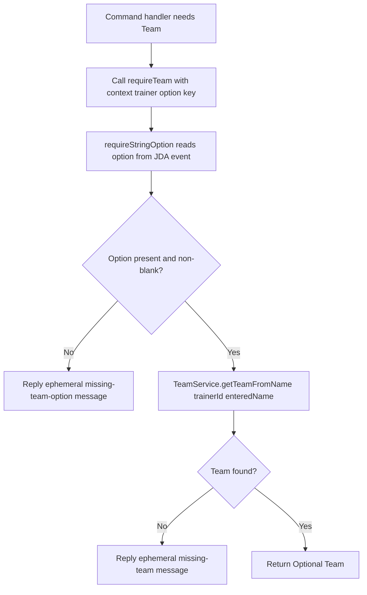
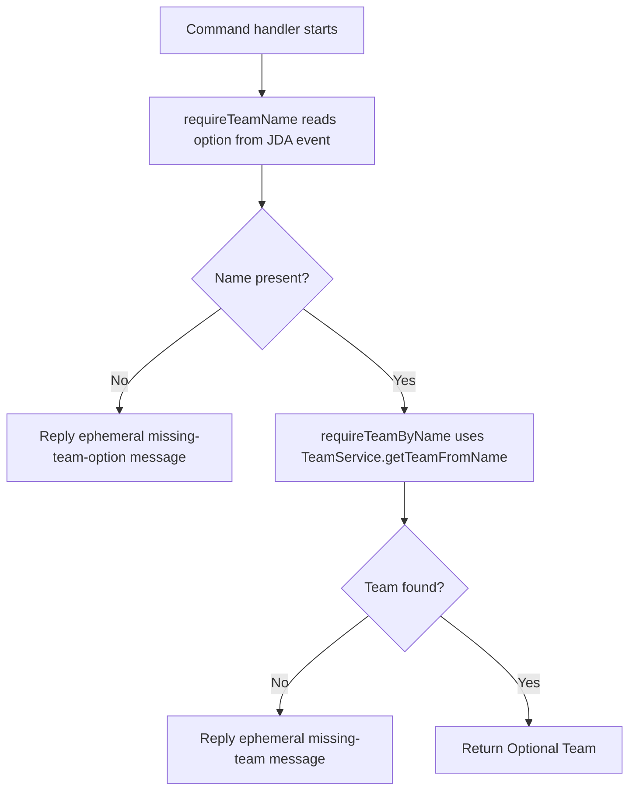

# requireTeam Design Guide

**Date:** 2026-04-22  
**Audience:** Junior Java developer  
**Scope:** Explain why `requireTeam(...)` in [SlashCommandSupport.java](../src/main/java/pokemonGame/bot/refactor/SlashCommandSupport.java) is shaped the way it is, and whether splitting it is the right fix for the current `AddPokemonSlashCommand` issue.

---

## 1. Short Answer

`requireTeam(...)` is trying to do one high-level bot-layer job:

- take a slash-command event
- read the team option from that event
- turn that string into a real `Team` object
- reply with an error if any step fails

So idea behind method is reasonable.

Bug in `AddPokemonSlashCommand` was not proof that helper idea is wrong. Bug happened because call site treated one parameter like **entered team name**, while helper treats it like **option key inside the JDA event**.

That means real problem is **API clarity**.

---

## 2. What Problem requireTeam Is Solving

Before helper exists, command handlers repeat same steps over and over:

1. read option from Discord event
2. check whether option exists
3. look up trainer-owned team by name
4. send ephemeral error if team is missing
5. return loaded `Team`

That repeated logic is not the real purpose of commands like `addpokemon`, `teachmoveset`, or `startbattle`. It is controller glue.

`requireTeam(...)` exists to remove that glue from each command handler.

Plain English version:

- command says, "I need a team before I can continue"
- helper says, "I will fetch it or stop with a user-facing error"

That is why helper returns `Optional<Team>` instead of throwing.

---

## 3. Why Method Takes an Option Key

Current method in [SlashCommandSupport.java](../src/main/java/pokemonGame/bot/refactor/SlashCommandSupport.java) takes this parameter:

- `String teamOptionName`

That value is meant to be the **name of the slash-command option**, such as `"teamname"`.

Why it is formed this way:

- helper starts from raw JDA event
- raw JDA event does not contain one generic "current team"
- helper must know which option to read from the event
- once it has the string value, it can ask `TeamService` for the real `Team`

So helper is effectively saying:

> "Tell me which slash-command field contains the team name, and I will do the rest."

That is a valid design.

---

## 4. Current Flow

### Flowchart: Current Combined Helper

### Plain English Walkthrough

This helper combines two steps that often happen together:

1. read the team name string from Discord input
2. convert that string into a `Team` object

That combined shape is convenient because most command handlers do not care about the raw team name for very long. They only care whether they now have a usable `Team`.

That is why combined helper can feel nice in controllers: one call, one result, one place for reply messages.

---

## 5. Why AddPokemon Broke

The confusion happened in [AddPokemonSlashCommand.java](../src/main/java/pokemonGame/bot/refactor/commands/AddPokemonSlashCommand.java).

The handler did this pattern:

1. read `teamname` itself with `requireStringOption(...)`
2. store actual entered value, like `"Blue Team"`
3. pass that value into `requireTeam(...)`

But `requireTeam(...)` expected the option key, not the entered value.

So helper heard:

- "Look for slash-command option named `Blue Team`"

instead of:

- "Look for slash-command option named `teamname`"

That is why command failed even though helper itself was doing what it was written to do.

Important lesson:

When a helper accepts a `String`, the meaning of that string must be extremely obvious. If callers can confuse **field name** and **field value**, API shape is too easy to misuse.

---

## 6. Is Hardcoding teamname Inside requireTeam Right Fix?

Possible fix is:

- remove `teamOptionName` parameter
- always read `"teamname"` inside helper

This would fix the specific confusion.

### Why hardcoding feels attractive

- fewer parameters
- fewer chances to pass wrong string
- matches current command registration in [BotRunner.java](../src/main/java/pokemonGame/bot/BotRunner.java)

### Why hardcoding is usually not best long-term fix

- helper becomes less reusable
- future commands may use a different option key
- future commands may need two team options, like `sourceTeam` and `targetTeam`
- hardcoding hides an assumption that belongs in the API contract

Plain English version:

Hardcoding is simple, but only if project will always have exactly one team field name everywhere.

That is not terrible for a small project, but it is brittle architecture if command vocabulary grows.

---

## 7. Is Splitting the Helper Right Fix?

Possible split:

- `requireTeamName(...)` reads string from JDA event
- `requireTeamByName(...)` or `loadRequiredTeam(...)` turns string into `Team`

### Flowchart: Split Helper Design

### Why split can be better

- removes ambiguity between option key and option value
- avoids double-reading event when handler also wants raw team name
- lets one command log or reuse raw string while another only wants `Team`
- makes method names describe exact job

### Why split can be worse

- more helper methods
- slightly more verbose call sites
- some handlers will now make two helper calls instead of one

So split is not automatically better. It is better when codebase has **two real use cases**:

1. handlers that only want a `Team`
2. handlers that need the raw team name string first, then later need the `Team`

---

## 8. What Is Actually Right Fix For Your Current Issue?

### Smallest Correct Fix

For the current `AddPokemonSlashCommand` bug, split is **not required**.

Smallest correct fix is simply:

- do not read team name separately
- call `requireTeam(context, teamService, trainer, "teamname", ...)`

That keeps helper design intact and fixes the bug immediately.

### Best Clarity Fix

Even if you keep combined helper, current parameter name should improve.

Better names:

- `teamOptionKey`
- `teamOptionId`
- `teamFieldName`

Worse name:

- `teamOptionName`

Reason: "name" sounds too much like actual entered team name.

### Best Long-Term Fix If This Confusion Keeps Happening

If more handlers want both:

- raw team string
- resolved `Team`

then split is the better API.

Not because combined helper was wrong. Because codebase now has two valid workflows and one ambiguous helper is trying to cover both.

---

## 9. Best Recommendation For This Project Right Now

Best practical path:

1. Keep current combined helper for now.
2. Rename parameter to something like `teamOptionKey`.
3. Fix `AddPokemonSlashCommand` by not pre-reading team name unless it actually needs raw string.
4. Only split helper if another command truly needs raw team name as separate value.

Why this recommendation:

- fixes real bug with smallest change
- preserves refactor momentum
- avoids over-engineering too early
- keeps option for split later if usage proves necessary

This is important engineering habit:

Do not refactor because one bug happened. Refactor because bug reveals repeated mismatch between API shape and real usage.

Right now you have **one clear misuse** and **one slightly ambiguous parameter name**. That points first toward API cleanup, not automatic decomposition.

---

## 10. Hybrid Option: Best of Both Worlds

Another good design is to keep current combined helper and add a second helper instead of replacing it.

Example idea:

- `requireTeamFromOption(...)` — combined helper, explicit that it reads event option
- `requireTeamByName(...)` — helper for cases where handler already has a string

This is often better than deleting current helper, because it makes both workflows explicit.

Plain English version:

- one helper for "I have an event field"
- one helper for "I already have the name"

That is very hard to misuse.

---

## 11. Final Takeaway

`requireTeam(...)` is shaped the way it is because it is a **controller helper**, not a pure lookup method.

It does not only ask `TeamService` for a `Team`. It also owns:

- reading input from JDA
- validating missing input
- sending user-facing failure replies

So current shape is defensible.

For your exact bug, split is **not mandatory**. Better first fix is:

- call helper correctly
- rename confusing parameter

If later you keep needing both raw team string and loaded `Team`, then split becomes justified. At that point split is not a reaction to one mistake. It is a response to real API pressure.
