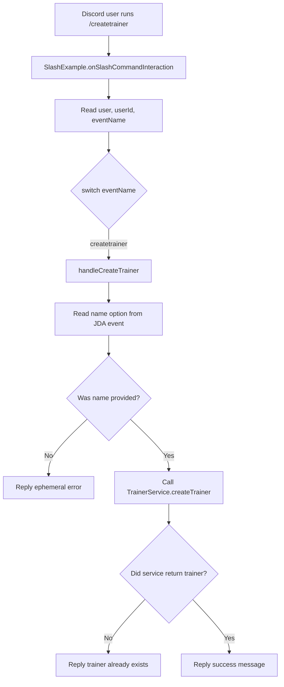
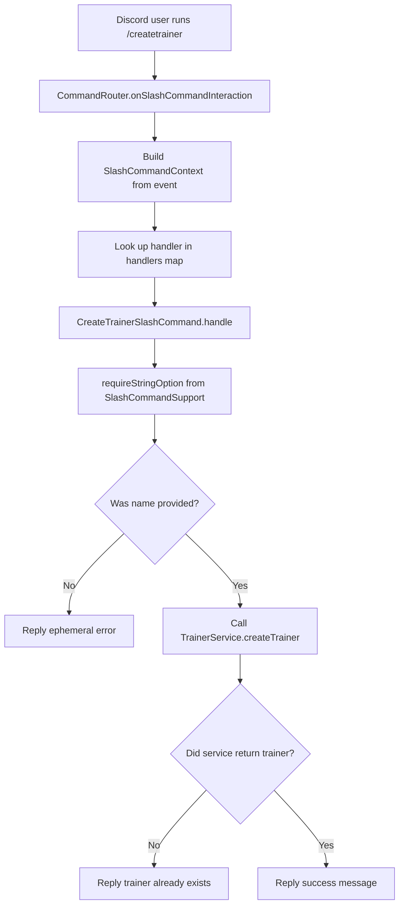
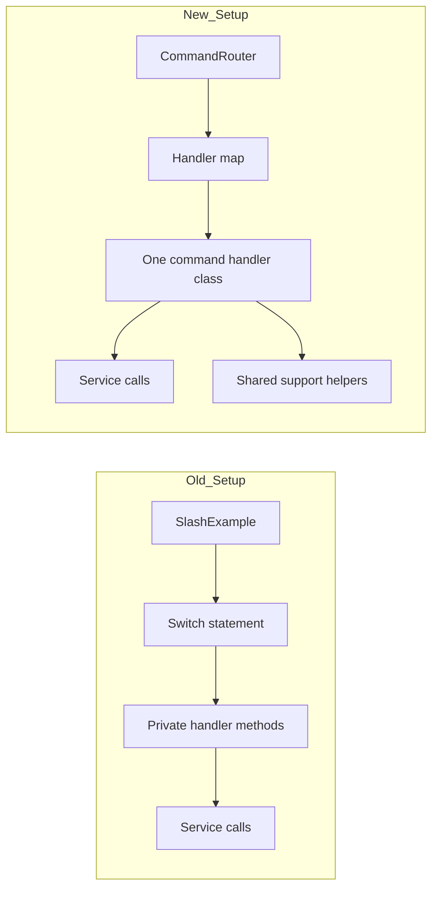
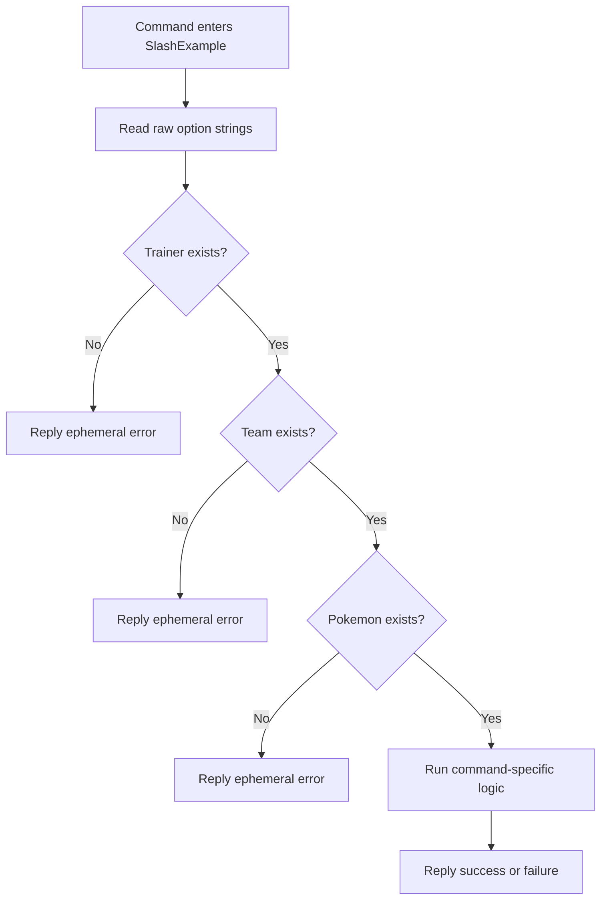
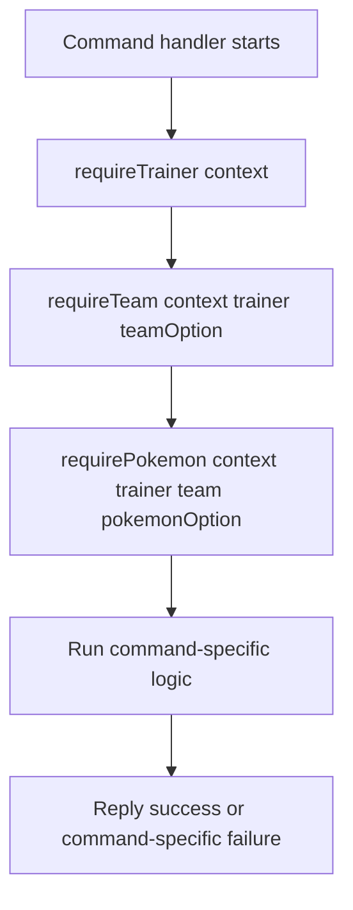

# Slash Command Routing Refactor Guide

**Date:** 2026-04-21  
**Audience:** Junior Java developer  
**Scope:** Compare old listener in [SlashExample.java](../src/main/java/pokemonGame/bot/SlashExample.java) with parallel router setup in [CommandRouter.java](../src/main/java/pokemonGame/bot/refactor/CommandRouter.java)

---

## 1. Big Picture

Both setups do same job: take a Discord slash command, decide which game logic should run, call the service layer, then send a reply back to Discord.

Main difference is **where that work lives**.

- Old setup keeps routing and command logic in one class: [SlashExample.java](../src/main/java/pokemonGame/bot/SlashExample.java)
- New setup splits responsibilities across small classes in [src/main/java/pokemonGame/bot/refactor](../src/main/java/pokemonGame/bot/refactor)
- Old and new setups both still use JDA events and same service classes, such as [TrainerService.java](../src/main/java/pokemonGame/service/TrainerService.java)

Plain English version:

- Old version says: "one listener handles everything"
- New version says: "one listener routes, one handler owns one command"

That may sound like a small change, but it changes how easy code is to read, test, and extend.

---

## 2. Files In Each Setup

### Old Setup

- [SlashExample.java](../src/main/java/pokemonGame/bot/SlashExample.java): one JDA listener with a `switch` on command name and many private handler methods

### New Parallel Setup

- [CommandRouter.java](../src/main/java/pokemonGame/bot/refactor/CommandRouter.java): thin router listener
- [SlashCommandHandler.java](../src/main/java/pokemonGame/bot/refactor/SlashCommandHandler.java): contract for one command handler
- [SlashCommandContext.java](../src/main/java/pokemonGame/bot/refactor/SlashCommandContext.java): shared event data object
- [SlashCommandSupport.java](../src/main/java/pokemonGame/bot/refactor/SlashCommandSupport.java): shared helper methods for handlers
- [CreateTrainerSlashCommand.java](../src/main/java/pokemonGame/bot/refactor/commands/CreateTrainerSlashCommand.java): migrated `createtrainer` command
- [TeachMovesetSlashCommand.java](../src/main/java/pokemonGame/bot/refactor/commands/TeachMovesetSlashCommand.java): migrated complex command using shared trainer/team/Pokemon helpers

### Responsibility Comparison

| Concern | Old Setup | New Setup | Why Junior Dev Should Care |
| --- | --- | --- | --- |
| Find command by name | `switch` in `SlashExample` | `Map<String, SlashCommandHandler>` in `CommandRouter` | Easier to add commands without growing one big method |
| Hold per-command logic | Private methods in same class | One class per command | Smaller files are easier to understand |
| Share repeated event data | Rebuilt in listener methods | `SlashCommandContext` record | Less repeated boilerplate |
| Share helper logic | Repeated null/option/reply code | `SlashCommandSupport` | Common rules stay in one place |
| Call business logic | Listener methods call services directly | Handler classes call services directly | Service layer stays same, so behavior can stay stable during migration |

---

## 3. Old Code Path: `/createtrainer`

In old setup, the same class does all of this:

1. Receives Discord event
2. Reads user and command name
3. Chooses a branch in a `switch`
4. Calls `handleCreateTrainer(...)`
5. Pulls option data from JDA
6. Calls `TrainerService`
7. Decides which Discord reply to send

### Flowchart: Old Path



### Plain English Walkthrough: New Path

Think of [SlashExample.java](../src/main/java/pokemonGame/bot/SlashExample.java) as a front desk worker who also tries to do every other job in the building.

- It answers the door by receiving the JDA event.
- It checks which command came in.
- It chooses the matching branch in the `switch`.
- It then runs the code for that command itself.

This works, but there is a cost. The same class is responsible for many commands, and each new command makes the file larger. Even if each private method is separate, one class still owns too many reasons to change.

For a junior developer, the biggest risk is not that the code is wrong. The biggest risk is that the file becomes hard to navigate. When that happens, changes get slower and bugs hide more easily.

---

## 4. New Code Path: `/createtrainer`

In new setup, responsibilities are split:

1. Router listener receives the Discord event
2. Router builds a small context object
3. Router finds the handler for the command name
4. Dedicated handler runs command logic
5. Handler uses shared support methods for repeated event checks
6. Handler calls `TrainerService`
7. Handler sends reply

### Flowchart: New Path



### Plain English Walkthrough: Visual Comparison

Now think of [CommandRouter.java](../src/main/java/pokemonGame/bot/refactor/CommandRouter.java) as a receptionist instead of a do-everything worker.

- It receives the event.
- It asks, "Which command is this?"
- It hands the work to the correct handler.

The actual `createtrainer` behavior lives in [CreateTrainerSlashCommand.java](../src/main/java/pokemonGame/bot/refactor/commands/CreateTrainerSlashCommand.java). That file only cares about one command. This makes the code path narrower:

- router decides **who handles the work**
- handler decides **how this command works**
- service decides **how trainer creation happens in game/business logic**

That separation is the whole point of the refactor.

---

## 5. What Each New Class Does

### `CommandRouter`

Job: receive JDA slash events and route them.

It does **not** contain the detailed logic for every command. It mostly does two things:

1. turn the raw event into a [SlashCommandContext.java](../src/main/java/pokemonGame/bot/refactor/SlashCommandContext.java)
2. find the correct [SlashCommandHandler.java](../src/main/java/pokemonGame/bot/refactor/SlashCommandHandler.java) and call it

Why this helps:

- one place controls command registration
- command lookup is easy to scan
- router stays small even when command count grows

### `SlashCommandHandler`

Job: define the minimum contract for a routed command.

Every handler must answer two questions:

1. what command name do I handle?
2. what do I do when called?

Why this helps:

- every command follows same shape
- new handlers are predictable
- code review gets easier because classes look similar

### `SlashCommandContext`

Job: bundle shared event data into one object.

Without this record, each handler would repeatedly pull `event`, `user`, and `userId` apart. That is small duplication, but it adds up.

Why this helps:

- less repeated plumbing code
- handler methods take one argument instead of several
- future shared data can be added in one place

### `SlashCommandSupport`

Job: hold helper methods that many handlers will likely need.

Right now it contains:

- `requireStringOption(...)`
- `replyEphemeral(...)`

Why this helps:

- common validation logic stays consistent
- copy/paste error handling can move out of command classes
- next helpers can grow here, such as `requireTrainer(...)`, `requireTeam(...)`, or `requirePokemon(...)`

### `CreateTrainerSlashCommand`

Job: own `createtrainer` end to end.

This class now contains the command-specific behavior that used to live inside `SlashExample.handleCreateTrainer(...)`.

Why this helps:

- file name tells you exactly what it does
- testing one command becomes easier
- reading one command no longer means scrolling past all the others

---

## 6. Side-By-Side Mental Model

### Old Mental Model

```text
One listener class contains command routing and command behavior.
```

### New Mental Model

```text
One router class chooses a command handler.
One handler class owns one command.
Shared helper code lives in support classes.
```

### Visual Comparison



### Plain English Walkthrough

Old design groups work by **file**. New design groups work by **responsibility**.

- In old design, one file grows wider as more commands appear.
- In new design, command count grows sideways into more files, but each file stays small.

That tradeoff is usually worth it once a listener starts handling many commands.

---

## 7. What Stayed The Same

Refactor did **not** change everything.

- JDA still provides `SlashCommandInteractionEvent`
- `TrainerService` still creates trainers
- success and error replies still come from bot layer
- command behavior can stay identical during migration

This matters because a good refactor often changes structure first, behavior second. That lowers risk.

---

## 8. What Got Better

### Easier to Read

If you want to understand `createtrainer`, you can open one small file instead of searching inside a multi-command listener.

### Easier to Test

Router is thin. Handler is focused. Service is unchanged. That is much easier to test than a class that owns routing for every command.

### Easier to Add Commands

New command flow becomes:

1. create handler class
2. implement `commandName()`
3. implement `handle(...)`
4. register handler in router

That is simpler than expanding one class forever.

### Easier to Share Validation

The next repeated checks in this project are obvious:

- require trainer
- require team
- require Pokemon
- require valid option

Those checks can move into support helpers instead of being re-written inside each command.

---

## 9. Tradeoffs And Costs

## 9. How Shared Lookup Helpers Change Complex Commands

`createtrainer` is simple, so it does not fully show why support helpers matter.

The bigger win appears in commands like:

- [SlashExample.java](../src/main/java/pokemonGame/bot/SlashExample.java) `handleAddPokemon(...)`
- [SlashExample.java](../src/main/java/pokemonGame/bot/SlashExample.java) `handleTeachMoveset(...)`

Those commands do more than one job. They do command-specific work, but they also repeat the same lookup chain:

1. read option values from JDA
2. load trainer from Discord ID
3. load team from team name
4. sometimes load Pokemon from nickname
5. send error reply if any step fails

That repeated chain is not business logic for `addpokemon` or `teachmoveset`. It is setup and validation glue.

### Old Complex Command Shape

In old listener, a complex command usually looks like this:



### Plain English Walkthrough: Old Complex Command

Imagine `teachmoveset` as worker trying to do two jobs at once.

- Job 1: verify trainer, team, and Pokemon exist.
- Job 2: validate moves and teach them.

Those are different responsibilities.

When both live in same method, command-specific logic gets buried under defensive checks. Junior developers then spend most of their reading time inside validation branches instead of actual command behavior.

### Actual Helper-Based Shape In Parallel Setup

This is no longer only a plan. The parallel router now has a real example in [TeachMovesetSlashCommand.java](../src/main/java/pokemonGame/bot/refactor/commands/TeachMovesetSlashCommand.java).

Current helper flow:

- `requireTrainer(context)`
- `requireTeam(context, trainer, "team")`
- `requirePokemon(context, trainer, team, "pokemon")`

Then command handler can spend most of its code on the real command behavior.



### Plain English Walkthrough: Helper-Based Complex Command

This design changes code reading order.

Instead of seeing long repeated validation branches first, you see a short setup pipeline:

1. get trainer
2. get team
3. get Pokemon
4. do real command work

That matters because the method now reads more like the business story of the command.

For `teachmoveset`, the business story is:

- find target Pokemon
- validate chosen moves
- teach valid moves
- report result

For `addpokemon`, the business story is:

- find trainer and target team
- create Pokemon instance
- add it to team
- report slot or failure

Shared helpers move the repeated scaffolding out of the way so that story is easier to see.

### Why This Helps Junior Developers

- You debug validation in one helper instead of five command methods.
- You write new commands faster because setup code already exists.
- You can review command intent without getting lost in repeated null checks.
- When reply wording for missing trainer or missing team changes, you change it once.

### Important Note

This helper-based complex-command shape is now implemented once, but migration is still partial. The helper methods live in [src/main/java/pokemonGame/bot/refactor/SlashCommandSupport.java](../src/main/java/pokemonGame/bot/refactor/SlashCommandSupport.java), and the real example lives in [src/main/java/pokemonGame/bot/refactor/commands/TeachMovesetSlashCommand.java](../src/main/java/pokemonGame/bot/refactor/commands/TeachMovesetSlashCommand.java).

Right now `SlashCommandSupport` only contains:

- `requireStringOption(...)`
- `replyEphemeral(...)`

That is enough for `createtrainer`, but not enough to show full payoff for commands with deeper lookup chains.

---

## 10. Tradeoffs And Costs

This refactor is not free.

### More Files

Junior developers often notice this first. Yes, there are more files now. That can feel heavier at first.

But more files is not automatically worse. Ten small files with clear names are often easier to work with than one file that tries to do everything.

### More Indirection

In old setup, you can follow one direct jump from `switch` to private method.

In new setup, you follow:

1. router
2. handler map
3. command handler
4. support helper or service

That is one extra level of indirection. The payoff is cleaner organization.

### Temporary Duplication During Migration

Right now both systems exist side by side on purpose. That means there is temporary duplication until more commands move over.

That is acceptable for a safe migration because it lets you compare structures before replacing old code.

---

## 11. Why This Is Only A Skeleton Right Now

The new router setup is intentionally incomplete.

- only `createtrainer` is migrated so far
- router constructor still accepts same service set as old listener to keep future migration simple
- some injected services are unused today because only one command moved

That is normal for a skeleton refactor. Goal of skeleton is not "finish everything now." Goal is "prove structure works before moving whole system."

---

## 12. Recommended Next Migration Order

If continuing this refactor, safest order is:

1. move another simple command like `createteam`
2. add shared lookup helpers like `requireTrainer(...)`
3. move one medium command like `checkteam`
4. move one heavier command like `addpokemon` or `teachmoveset`
5. switch bot registration from old listener to router after enough parity exists

Why this order works:

- early commands prove pattern with low risk
- shared helper extraction pays off before complex commands move
- harder commands arrive after support layer exists

---

## 13. Final Takeaway

This refactor is about **separating routing from command behavior**.

Old setup is not wrong. It is simply reaching point where one listener owns too much coordination.

New setup makes that coordination more explicit:

- router finds command
- handler owns command
- support class owns common helper logic
- service layer owns business logic

That separation makes code easier to extend without turning the bot layer into one giant class.
