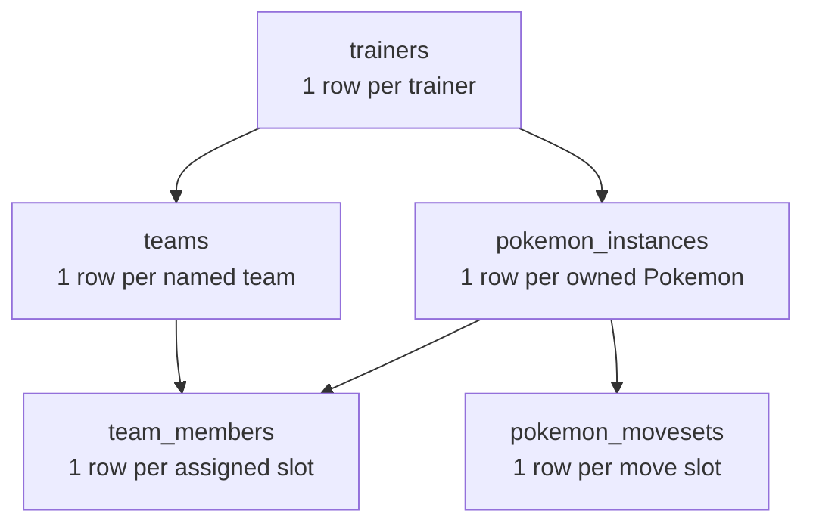
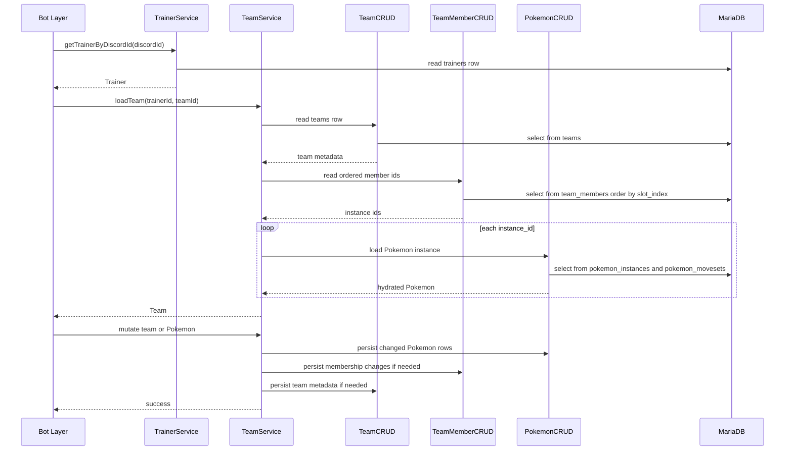

# Team Schema Split Guide

**Date:** 2026-04-17  
**Scope:** Split team metadata from team membership, then align DAO and service flow with that split  
**Java Version:** 21

---

## 1. Problem Summary

Right now the database and the Java code disagree about what `trainer_teams` means.

The live table is acting like a team-membership table because it stores:

- `slot_index`
- `instance_id`
- a foreign key to `pokemon_instances`

But the Java code also treats the same table like a team-header table because `createTeamForTrainer()` tries to create an empty team row before any Pokemon exists.

That causes two structural problems:

1. Empty team insert fails.
   Reason: `instance_id` is required and has a foreign key to `pokemon_instances`, so creating a team with no Pokemon forces an invalid value.

2. One table is carrying two different concepts.
   Reason: a team header is one row per team, but team membership is one row per Pokemon in that team.

This is why the current setup throws a foreign key error during team creation and why the table design stays fragile even if that one insert is patched.

---

## 2. Recommended Target Design

Split the current concept into two tables:

### `teams`

One row per named team.

```sql
CREATE TABLE teams (
    team_id      INT AUTO_INCREMENT PRIMARY KEY,
    trainer_id   INT NOT NULL,
    team_name    VARCHAR(50) NOT NULL,
    UNIQUE KEY uq_teams_trainer_name (trainer_id, team_name),
    FOREIGN KEY (trainer_id) REFERENCES trainers(trainer_id)
);
```

### `team_members`

One row per Pokemon assigned to a slot in a team.

```sql
CREATE TABLE team_members (
    team_id      INT NOT NULL,
    slot_index   SMALLINT NOT NULL,
    instance_id  INT NOT NULL,
    PRIMARY KEY (team_id, slot_index),
    UNIQUE KEY uq_team_members_instance (instance_id),
    FOREIGN KEY (team_id) REFERENCES teams(team_id) ON DELETE CASCADE,
    FOREIGN KEY (instance_id) REFERENCES pokemon_instances(instance_id) ON DELETE CASCADE,
    CHECK (slot_index BETWEEN 0 AND 5)
);
```

### Why this shape works

- `teams` can represent an empty team with no fake Pokemon row.
- `team_members` can represent 0 to 6 Pokemon per team.
- Team name is stored once instead of repeated on every member row.
- Slot order lives only where it belongs: the membership table.
- Deleting a team can cascade into `team_members` cleanly.

### Optional decision: should one Pokemon be allowed in more than one team?

The line `UNIQUE KEY uq_team_members_instance (instance_id)` means one Pokemon instance can belong to only one team at a time.

Keep that unique key if your design means:

- one owned Pokemon instance
- one current assigned team

Remove that unique key if your long-term design means:

- one owned Pokemon instance
- reusable across multiple saved team presets

For current behavior, keeping the unique key is the simpler and safer choice.

---

## 3. Visual Model



### Plain English Walkthrough

`trainers` owns player identity. `teams` owns team names and team IDs. `pokemon_instances` owns each actual Pokemon the trainer has caught or created. `team_members` connects a team to specific Pokemon instances and records slot order. `pokemon_movesets` stays attached to the Pokemon instance, not to the team.

That separation matters because a team is metadata, while a team member row is a relationship between a team, a Pokemon, and a slot.

---

## 4. DAO Split

Recommended change: split current `TeamCRUD` responsibilities into two DAO classes.

### `TeamCRUD`

Own only team-header data in `teams`.

Methods that belong here:

- `createTeamForTrainer(int trainerId, String teamName)`
- `getTeamName(int trainerId, int teamId)`
- `getActiveTeamIdForTrainer(int trainerId)`
- `getTeamNamesForTrainer(int trainerId)`
- `getTeamIdByNameForTrainer(int trainerId, String teamName)`
- future `deleteTeam(int trainerId, int teamId)`

### `TeamMemberCRUD`

Own only membership rows in `team_members`.

Methods that belong here:

- `addPokemonToTeam(int teamId, int pokemonId)`
- `removePokemonFromTeam(int teamId, int slotIndex)`
- `getPokemonIdsForTeam(int teamId)`
- `getSlotIndexForPokemon(int teamId, int pokemonId)`
- `getNextOpenSlotIndex(int teamId)`
- `reorderTeamAfterRelease(int teamId)`
- future `swapSlots(int teamId, int slotA, int slotB)`

### Why split the DAO too

If the schema is split but one DAO still treats both tables like one concept, the code stays mentally tangled. Two tables with two separate jobs deserve two separate data-access surfaces.

That keeps each query simpler:

- team lookup queries hit `teams`
- slot and membership queries hit `team_members`

---

## 5. Mapping Current Methods to New Ownership

| Current method | Recommended owner | Recommended table |
| --- | --- | --- |
| `createTeamForTrainer` | `TeamCRUD` | `teams` |
| `getTeamName` | `TeamCRUD` | `teams` |
| `getActiveTeamIdForTrainer` | `TeamCRUD` | `teams` |
| `getTeamNamesForTrainer` | `TeamCRUD` | `teams` |
| `getTeamIdByNameForTrainer` | `TeamCRUD` | `teams` |
| `addPokemonToDBTeam` | `TeamMemberCRUD` | `team_members` |
| `checkSlotIndex` | `TeamMemberCRUD` | `team_members` |
| `removePokemonFromDBTeam` | `TeamMemberCRUD` | `team_members` |
| `getPokemonIdsForTeam` | `TeamMemberCRUD` | `team_members` |
| `reorderTeamAfterRelease` | `TeamMemberCRUD` | `team_members` |
| `getSlotIndexForPokemon` | `TeamMemberCRUD` | `team_members` |

One small naming cleanup worth doing during implementation:

- rename `checkSlotIndex()` to something like `getNextOpenSlotIndex()` or `countMembers()`

Current name hides what the method actually returns.

---

## 6. Service-Layer Flow After the Split

`TrainerService` stays almost the same.

`TeamService` becomes the coordinator for:

- team creation
- loading team metadata
- loading membership rows
- hydrating Pokemon into a `Team`
- persisting membership changes

### Recommended dependency shape

`TeamService` should depend on:

- `TeamCRUD`
- `TeamMemberCRUD`
- `PokemonCRUD`
- `TrainerService`

### Core rule

The service layer should coordinate multi-step workflows. DAOs should not try to build full domain graphs.

That means:

- `TeamCRUD` returns team metadata
- `TeamMemberCRUD` returns ordered Pokemon IDs
- `PokemonCRUD` hydrates each Pokemon
- `TeamService` assembles the final `Team`

---

## 7. Basic Setup Flow

This is the clean flow for the common case you asked about: create trainer, create team, add a Pokemon, then rehydrate and dehydrate later.

### Step 1. Create the trainer

Write one row to `trainers`.

Expected result:

- database assigns `trainer_id`
- service returns a `Trainer` object with `trainerDbId` set

### Step 2. Create the team

Write one row to `teams`.

Expected result:

- database assigns `team_id`
- service returns a `Team` object with:
  - `teamDbId`
  - `trainerDbId`
  - `teamName`

Important rule: creating a team should not require a Pokemon row.

### Step 3. Add a Pokemon to that team

This is a two-write operation, not a one-write operation.

Order matters:

1. assign the `Trainer` to the in-memory `Pokemon`
2. persist the Pokemon into `pokemon_instances`
3. store the generated `instance_id` back onto the in-memory `Pokemon`
4. insert membership row into `team_members`
5. add the Pokemon to the in-memory `Team`

Why step 3 matters:

If you persist the Pokemon but never copy the generated database ID back onto the domain object, later operations like move persistence or release logic will still think the Pokemon ID is `0`.

That is the same class of failure you already saw with move persistence.

### Step 4. Rehydrate when needed

When a Discord command needs the trainer's team again:

1. load the `Trainer`
2. choose which team to load by ID or by name
3. load team metadata from `teams`
4. load ordered member IDs from `team_members`
5. load each Pokemon instance from `pokemon_instances`
6. load each Pokemon's moves from `pokemon_movesets`
7. build a fresh in-memory `Team`
8. attach that team to the in-memory `Trainer` for this request

### Step 5. Dehydrate when needed

When in-memory state changes, persist only the changed pieces:

- Pokemon stat or HP changes -> `pokemon_instances`
- moves learned or PP changes -> `pokemon_movesets`
- team membership changes -> `team_members`
- team rename -> `teams`

Then the in-memory objects can be discarded after the request finishes.

That matches your intended design: one in-memory team per trainer object, rehydrated for the current workflow, not treated like a permanent cache.

---

## 8. Request-Scoped Team Lifecycle



### Plain English Walkthrough for Lifecycle

The bot should not keep one giant always-live object graph for every trainer. Instead, each command loads only the trainer and team it needs, works on those in memory, writes changes back, then lets those objects go out of scope.

That gives you:

- simpler memory behavior
- fewer stale-object bugs
- cleaner restart behavior
- better alignment with Discord command handling

---

## 9. Migration Plan

Because this project already has `DatabaseMigrator`, the clean approach is a versioned SQL migration.

### Recommended migration file

Add a new migration file such as:

- `src/main/resources/db/migrations/V002__split_teams_from_team_members.sql`

And add it to:

- `src/main/resources/db/migrations/manifest.txt`

### Migration strategy

#### Option A. Fresh-schema approach

Use this if existing team data is disposable.

1. create `teams`
2. create `team_members`
3. drop old `trainer_teams`
4. update Java queries
5. repopulate test data through services

This is the simplest approach for a learning project and for test databases.

#### Option B. Data-preserving approach

Use this only if current data matters.

1. create `teams`
2. create `team_members`
3. copy distinct `(trainer_id, team_name)` pairs into `teams`
4. map old rows into new `team_members`
5. verify slot ordering manually
6. drop old `trainer_teams`

Important warning:

Do not trust the current `team_id` values as a stable team identity model. The existing live schema already mixes header rows and member rows, so old data may need manual verification before migration.

---

## 10. Implementation Order

Recommended order for the actual code work:

1. Add migration file for `teams` and `team_members`.
2. Update database documentation so table purpose is explicit.
3. Split DAO responsibilities.
4. Update `TeamService` constructor and workflows.
5. Update tests that create teams or add Pokemon.
6. Run targeted DAO and service tests.
7. Run full Maven test suite.

Reason for this order:

- schema first
- queries second
- orchestration third
- tests last, once the foundation is stable

---

## 11. Test Setup Pattern After the Split

For service tests, the clean pattern should be:

1. create trainer through `TrainerService`
2. fetch returned or persisted trainer
3. create team through `TeamService`
4. assign trainer to the in-memory Pokemon before persisting it
5. add Pokemon through `TeamService`
6. if later logic depends on database IDs or move rows, either:
   - ensure the service copied generated IDs back onto the object, or
   - rehydrate the Pokemon or Team from the database before asserting

That avoids two common failures:

- creating a team before the schema can represent empty teams
- adding a Pokemon whose in-memory object still has no trainer or no database ID

---

## 12. Common Pitfalls

- Do not query team name from the membership table after the split. Query it from `teams`.
- Do not store `trainer_id` redundantly in `team_members` unless you have a strong reason. `team_id` already points back to the owning trainer through `teams`.
- Do not create a team row that depends on a Pokemon foreign key.
- Do not forget to set the generated Pokemon DB ID back onto the domain object after insert.
- Do not let DAO methods silently swallow SQL errors in tests without assertions.
- Do not keep long-lived cached `Trainer` and `Team` objects across unrelated Discord requests.

---

## 13. Final Recommendation

Split both the schema and the DAO surface.

Best target shape:

- `trainers` -> trainer identity
- `teams` -> team metadata
- `team_members` -> slot membership
- `pokemon_instances` -> Pokemon state
- `pokemon_movesets` -> per-instance move state

That gives you a model where:

- team creation works without fake Pokemon rows
- loading a team is straightforward
- releasing or reordering Pokemon only touches membership rows
- request-scoped rehydration stays simple and predictable
- tests can set up trainer -> team -> Pokemon in the same order the real application uses
